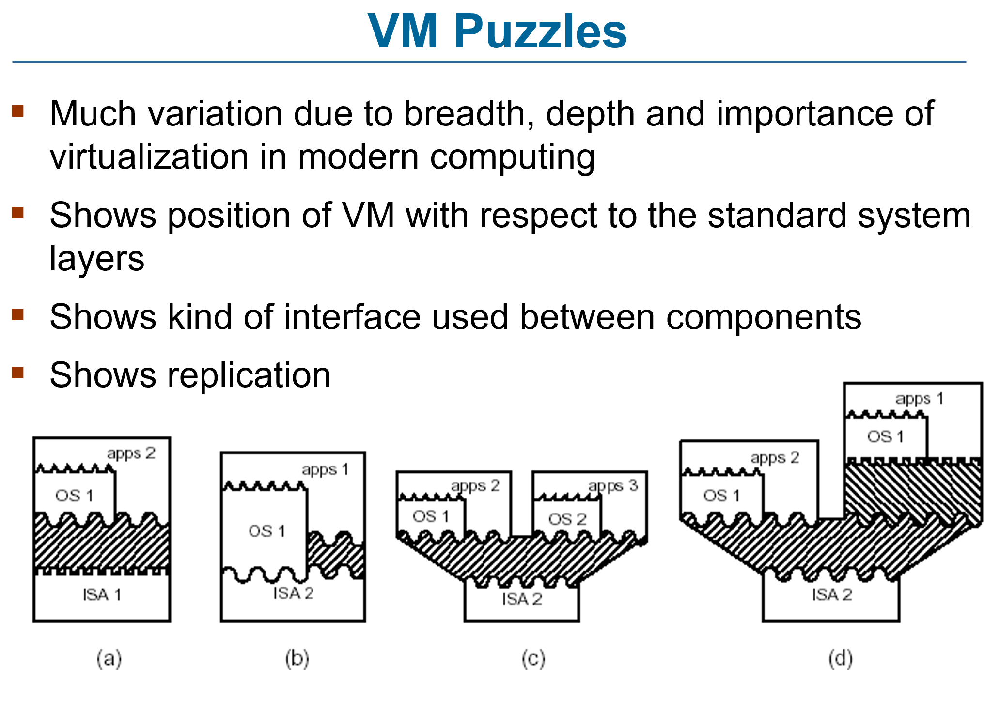
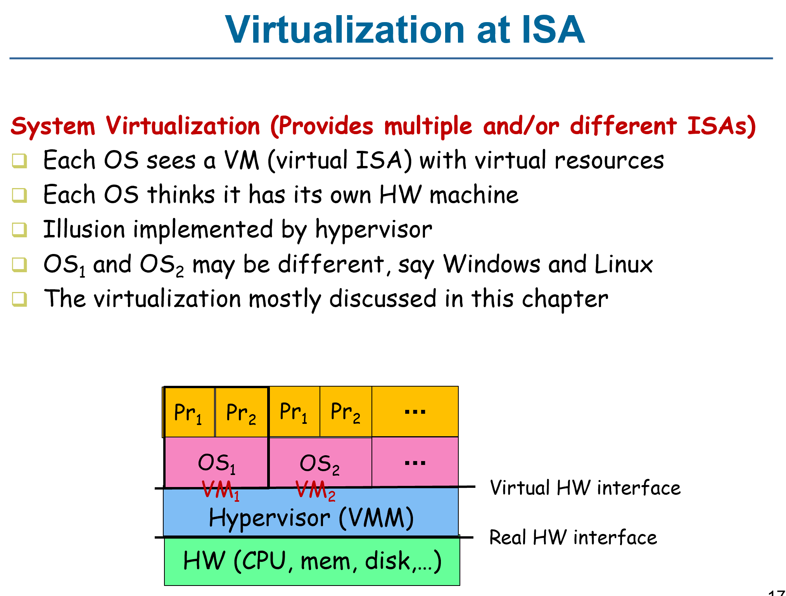
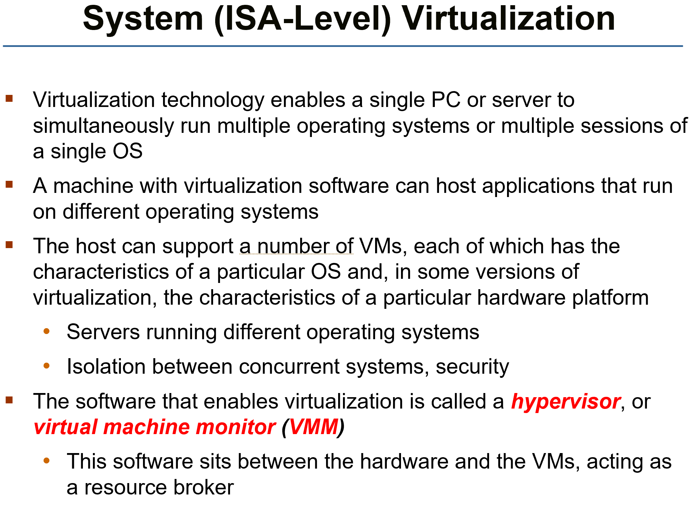
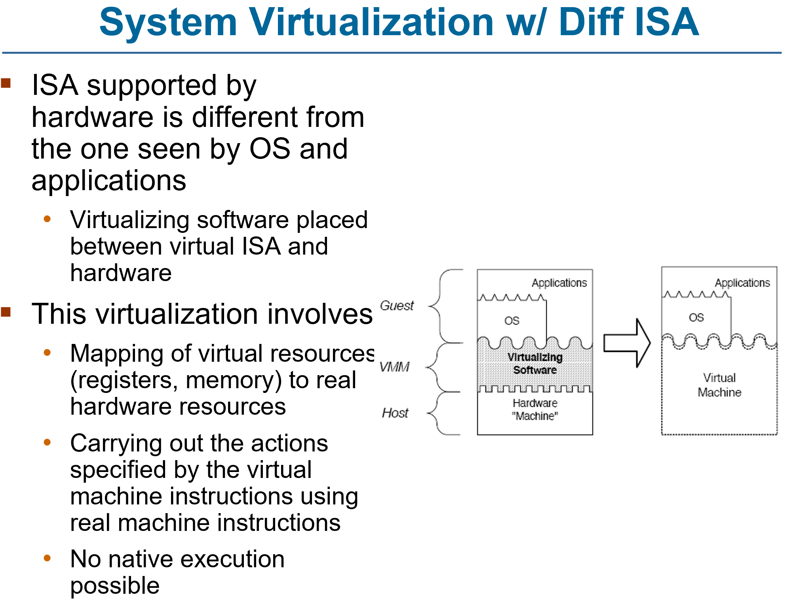
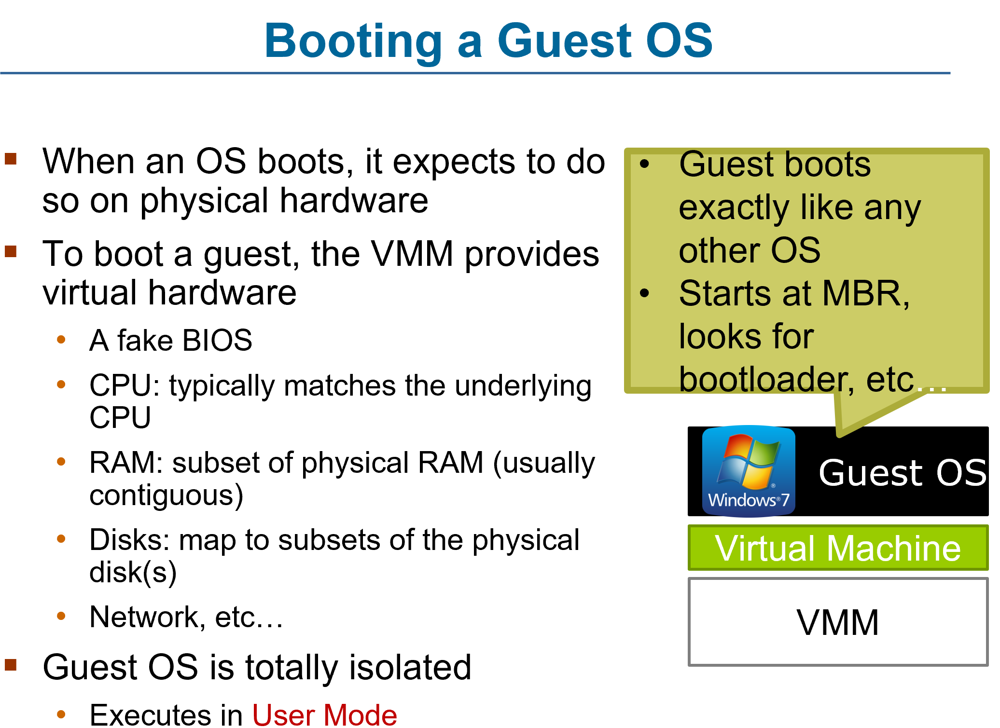
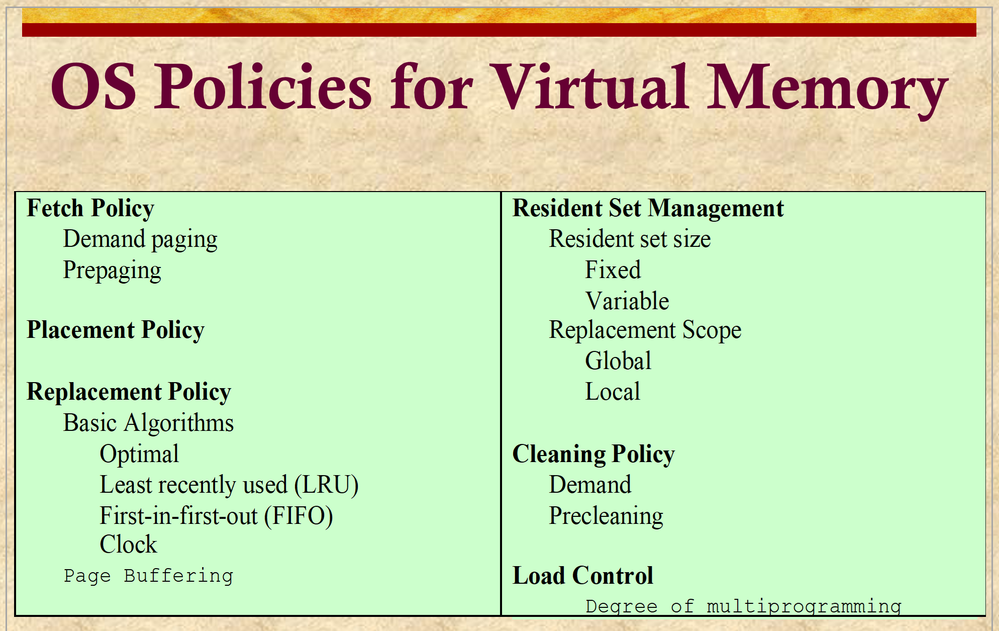
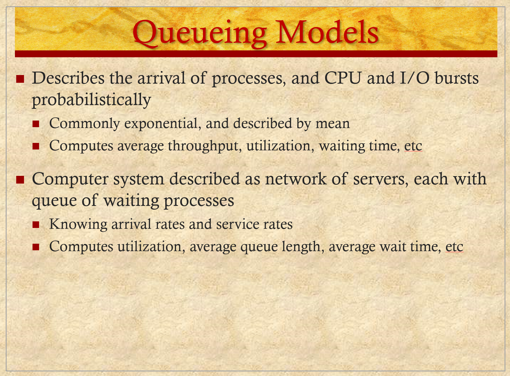
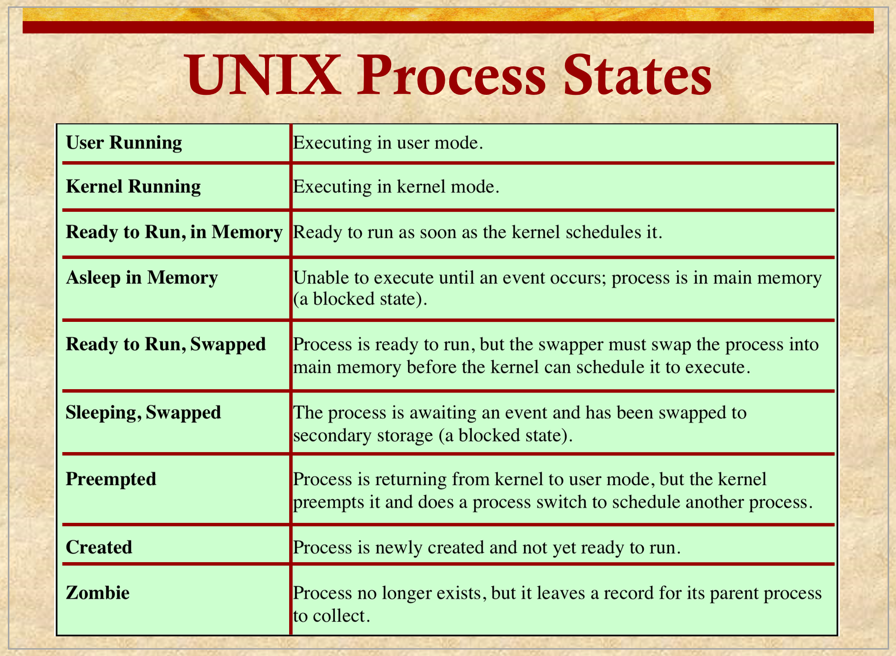

# ENEE447 Lecture 1  

> 1/24/24

### Syllabus  

Need to buy a Raspberry Pi  

2 exams, non cumulative  

Approx. March 13 and May 8  
* Old Exams available on ELMS huh, how unlike a certain professor who also teaches OS...

### Chapter 2: OS Overview  

3 major parts:
* Processor management
* Memory management
* I/O management  

After, may cover security, VM, cloud computing, etc.  

1st part is biggest acc. to prof  

  

  

Anytime a system has more than one program running, must manage th processes, enable protection, etc.  

Operating systems are as varied as the computer systems that we have all around us  

  

Not much time spent on structure  

Modular structures are good in profs opinion  

^ modular, V speed  
* Still good for learning and productivity  

Need to share the resources and protect processes from each other when the time calls for either of them  

Security: Prevent external threats from manipulating our OS  

  

Persistence: Related to IO  

  

  

At the bottom, we have the HW (internal)  

ISA is the interface that allows for SW to manipulate HW  

OS runs in kernel mode w/ higher privileges  

API refers to user programs  
* Sometimes for efficienty, may need to access the OS directly. Use ABI in this case  

If only the OS may interact with the HW, will be very inefficient. This is why we have the bit on the RHS where somtimes the libraries and application programs are using the HW directly  

  

  

3 is the end-user view  

Virtual machine
* Virtualization at different levels  

  

Example of VM  

  

IN a ssytem with only one process, short bursts of CPU executions, with long IO waits  
* Very inefficient  
 * This is where we can use multiprogramming to our advantage  

  

With this, wait times are getting overlapped, making more use of the processor  

However, due to this, resource management becomes more of a concern (we dont want programs to colbber each others resources)  

  

  

  

We need interrupts in order to stop execution for any reason (IO, checks, etc.)  

  

If a program wants to interrupt the system, we make a system call which is trickled down to the HW  

  

deja vu...  

  

The Linux API will list all the system calls it supports
* OS must support all system calls  

  

  

  

Device: IO devices  

  

  

  

  

Note that certain system calls are vastly differnt between OSs. THis is why people usually use APIs
* Differences go beyond name, some implementations are vastly different (i.e fork vs CreateProcess)  

  

Doing this will slow us down, so there are concessioons between portability and speed  

`read_command` will take the command and the parametes inserted and store them into `command` and `parameters`. This will then allow the child to execute the command with the parameters  

  

IO devices are accessible only in kernel mode  
* Accessed by device driver  
    * Driver is processed by the CPU 

DMA: Direct Memory Access  

  

CPU and disk controller usually overlap  

  

Whats th limit? Wher should we stop, if at all?  
* We dont want too many procees active at a time  
* Memory wil need to be partiioned  
* Proceses may not get sufficient memory  

Medium term scehduler will decide how many active proceses to keep in memory 

Long term scheduler will figure out how many resources we have and if we can assign processes  

Short term scheduler will decide which process to run next in this ^ timeline  
* Different ways to implement this  

  

  

  

What if a program is never giving up the CPU? 
* We wnt the OS to gain control after a certain amount of time
* before giving control to the procss, we have a time for it. As long as it is not doing IO, and it is taking too long, we send a HW interrupt and force it to gain control once again  

  

Process manager: OS  
* Int. handler also part of OS  

When P1 goes to Process manager, we know that we have made a system call  

When Pn goes to int. handler, we know there was a HW interrupt (keyboard, etc.)  

Every time control comes to kernel mode, scheduler gets to run  

Always looks at the whole picture  

Unless specifically mentioned, we always talk about a single core system  

  

Time is being shared among different processes  

We need interrupt-based context switches for these interactive applications  

*Review over, time for the new stuff*  

  

Program: Static lines of code sitting somewhere in memory  

Process: Dynamic instance of a program that is currently running  

  

  

Green is the sturcture of the Unix OS
* File subsystem: IO  

Both sides may need to talk to each other  

File system is character based system  

  

  

  

  

Next time: Chapter 3 and processes  

