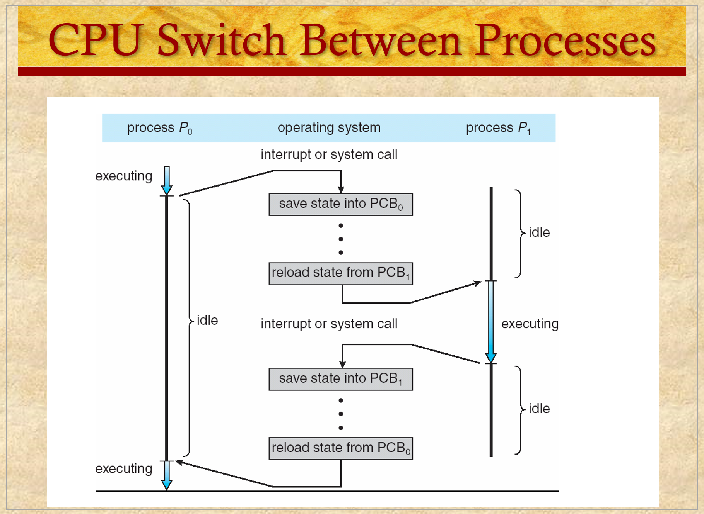

# ENEE447 Lecture 2  

> 1/29/24

### Chapter 3: Process control and description  

Labs this week  
* QEMU simulator may be used in lieu of physical board  
    * Our choice as to which to use,either phys. or sim.  

Today: Processes
* What are they?
* How do we track them?  

  

  

  

Before a process is in execution, it is a static program in memory  

Program does not have any change once it is stored in memory
* Process will change whilst in execution  
    * Wasn't always the case

Next instruction to be executed is stored in the program counter  

Order in memory is as such:  
* PC
* Registers 0-n
* Memory (usually not contiguous with the rest of the stuff here)

Memory:
* Text
* Data
* Heap V
* Stack ^  

Process starts at an initial state then continues until it is terminated  

  

  

OS has to manage all these things 

However, OS cannot really keep track of the entire memory
* Just needs to keep track of where the memory is  

Priority: Different priority to different processes  

  

  

Every active process has it's own PID

  

We need an OS if we have more than one process  

Context switch occurs at HW interrupt or software interrupt  

"save state" refers to the information about the program (PC, registers, text, etc.)

The reason for saving these values is that thy are saved to the PCB as though the process is running
* Therefore, when we return to P0, we know where we were before the switch  

Even though we saved the registers, memory was not. How do we keep track?
* Partition memory for each process  
* This is done in the physical memory  

Register is time shared, but memory is not

  

  

  

  

How much should be shared between the parent and the child?
* Many different ways, some advantages and disadvantages  
* Up to th programmer as to which to use  

Concurrency: Does not necessarily mean they are running at the same time!  
* With multithreading, there is a core/ pipeline with FETCH, DECODE, and EXECUTE.
* Specifically, with multiple threads, multiple threads may be in, for example, the FETCH step at once  

  

Allocating space for the process involves going into the physical memory and making room for it  

  

  

  

  

Child gets pid of 0  

When we fork, two processes will continue, the parent and the child. Depending on the pid, we may wnt to do different things  

The benefit of this over thw Windows way is that the child may be able to get more information for itself to figure out what it needs to do  

In the past, we would need to copy over the pages in memory from the parent to the child, which was inefficient  

A better solution was to have page tables, that kep track of the data for each process. Thus, all we needed to do was copy the page table to and fro. This is more efficient since we need only copy the addresses of the pages that hold the pages of memory needed  
  

  

  

  

  

  

Android does not have the concept of virtual memory/ paging. Thus, processes must be terminated in order to have enough for more important processes

  

Just to manage the processes, we may see it as a finite machine  

Even if in not running, a process is still in the system  

  

Queue is not necessarily FIFO, just needs to hold the processes  

Downside with this model is that there can be traffic at the "Not Ready" state

Solution is a three state model  

  

A HW interrupt is not related to the process, therefore it will cause it to go back to ready  *???*

When a process is in "Waiting", it must go back to "Ready" in order to get access to the processor once more  

Bottom image demonstrates when there are multiple things that a process is waiting for  

Even though we use multiple queues, it is still 3 state 

  

  

4 state

Lets say a process may wait for a long time
* Even when waiting, process is holding on to memory  
* We need to clear it up in by going from "Blocked" to "Suspend"  

Medium-Term scheduler: Which processes should be in the suspend state

Short: Decided which of the ready processes can run next

Long: If there is a fork, is it satisfied? *???* 

  

Blocked == Waiting  

Ready -> Suspend: Too many processes in memory, need to free up space  

This is where we stop, but there are a few more wih a few more states  

Without suspend, such as in Android, it stores into flash memory
* Flash memory has limited number of write cycles
* This is why Android uses the simplest model and deletes anything that is unnecessary  

  

  

Apart from PCB, we have other information to keep track of
* This information is organized in tables  

  

Memory tables may help when we have some pages in swap space and we need to keep track for a process that uses said pages in swap space

  

  

  

  

  

  

Different ways to relate processes and operating systems  

Separate Kernel:
* If P1 makes a system call, kernel is independent. thus, can only transfer information via another system call *???*  

OS functions execute within a user process
* We have operating system running in kernel mode
* UM memory and Privileged memory, all is accessible
    * If we want to transfer data, we can keep it in place with a large buffer, make a system call, and OS will be able to see it

OS functions exec as separate processes
* *???*

*Ended here, will pick up next lecture*
