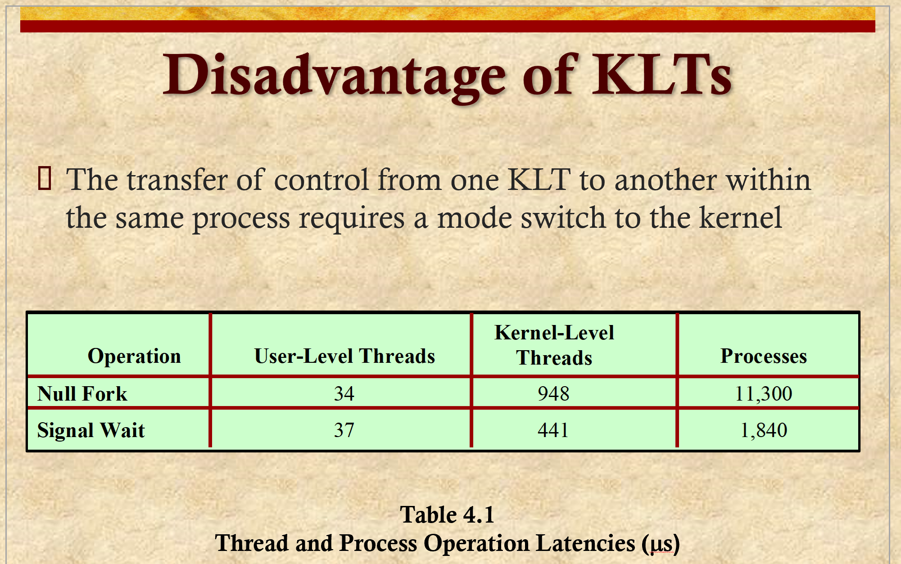

# ENEE447 Lecture 3  

> 1/31/24

### Chapter 3: Process control and description (cont.)  

  

  

Refers to the middle model from last lecture:  

 

The scheduler and other parts are not operating on a per-process basis  

There will be a hybrid of the three models shown last lecture IRL

   

Both user and kernel running could be classified as "Running"  

Asleep == Blocked or Waiting  

   

   

   

  

Background processes are prioritized  

  

  

Since there is no hard disk and we only use flash that can only be written a set amount of times, we have no notion of virtual memory on Android  

  

  

  

* Intro to processes
* Will talk more about the specifics in later chapters

### Chapter 4: Threads  

What are they?
* With processes, everyone agrees what a process is
    * Some debate when it comes to threads, however

  

  

LHS: System with 3 active processes  

Each process has one thread
* Thread: Line of control

RHS: One process, with multiple lines of control
* Three different PC values  

Each thread has its own PC value  

Why do we create child processes if the parent can do it anyways?  
* Main advantage: Easier to program with things separate rather than having one large program to do everything  

Forking has a big overhead
* TEchnically, a new address space must be made  

Threads idea is the same
* Parent thread, and want ot do something on the side
* Rather than putting everything to the side, easier to spawn a clone 
* Since forking a process is very expensive, makes sense to spawn a thread, which share a lot of things with the parent
    * OVer head reduces accordingly  

This chapter, we talk about different threads, their pros/cons  

  

Unix introduced the notion of switching between processes  

  

We will be looking at the lower right-hand quadrant model the most this class

  

  

say we have 4 cores. More threads == run in parallel  
* This is a more modern advantage  

  

  

Here, we spawn a new thread for each service request  

  

  

What is private for a thread and what is shared?  

Processes have private things between parent and child

Thread's memory address space is shared with its child  
* Address is data, text, heap, etc. NOT the stack  

Why not the stack? 

Say you have one thread, and you call a func, then spawn a thread. This child in turn calls a function. Each function call takes up space on the stack. The parent's function is now " underneath" the child's function. When the parent wishes to return, there will be clobbering, since the child's function is currently on the top of the stack  

  

  

  

  

Motivation for threads  

  

  

For the data section, there must be some synchronization for it since it is read/write

  

  

  

LHS: User level thread
* on the LHS, we have 2 processes, with 3 and 4 threads respectively  
    * OS does not have access nor knowledge of these threads since processes are individual  
    * The pink block represents the thread management system (run time system), which is done by way of the libraries  
    * con: Cannot benefit from multi-cores
        * Cannot have multiple threads running at the same time, since the OS chooses which process to run on a core  

RHS: Kernel level thread
* OS keeps track of all the threads  
* More flexible means that we can benefit from the multi-core scheduling *???*  
* Using the OS in this way creates a higher overhead

Which is better?
* It depends suddenly, I got a shiver down my spine, like I've heard this line before...  

Making a system cal makes a context switch 

Better question: When would you want to use the one on the left, and when would you want to use the one on the right
* LHS: If you have only one core
* RHS: Many cores available  

If you have very short threads, which is better?  
* LHS: Since involving the OS has a higher overhead, if the threads are going to be quick anyways, better to not involve it at all  

  

  

  

  

From the slides: 

> By default, an application begins with a single thread and begins running in that thread. This application and its thread are allocated to a single process managed by the kernel. At any time that the application is running (the process is in the Running state), the application may spawn a new thread to run within the same process. Spawning is done by invoking the spawn utility in the threads library. Control is passed to that utility by a procedure call. The threads library creates a data structure for the new thread and then passes control to one of the threads within this process that is in the Ready state, using some scheduling algorithm. When control is passed to the library, the context of the current thread is saved, and when control is passed from the library to a thread, the context of that thread is restored. The context essentially consists of the contents of user registers, the program counter, and stack pointers.

> All of the above activity takes place in user space and within a single process. The kernel is unaware of this activity. The kernel continues to schedule the process as a unit and assigns a single execution state (Ready, Running, Blocked, etc.) to that process. The following examples should clarify the relationship between thread scheduling and process scheduling. Suppose that process B is executing in its thread 2; the states of the process and two ULTs that are part of the process are shown in Figure 4.6a . Each of the following is a possible occurrence:

> 1. The application executing in thread 2 makes a system call that blocks B. For example, an I/O call is made. This causes control to transfer to the kernel. The kernel invokes the I/O action, places process B in the Blocked state, and switches to another process. Meanwhile, according to the data structure maintained by the threads library, thread 2 of process B is still in the Running state. It is important to note that thread 2 is not actually running in the sense of being executed on a processor; but it is perceived as being in the Running state by the threads library. The corresponding state diagrams are shown in Figure 4.6b .

> 2. A clock interrupt passes control to the kernel and the kernel determines that the currently running process (B) has exhausted its time slice. The kernel places process B in the Ready state and switches to another process. Meanwhile, according to the data structure maintained by the threads library, thread 2 of process B is still in the Running state. The corresponding state diagrams are shown in Figure 4.6c .

> 3. Thread 2 has reached a point where it needs some action performed by thread 1 of process B. Thread 2 enters a Blocked state and thread 1 transitions from Ready to Running. The process itself remains in the Running state. The corresponding state diagrams are shown in Figure 4.6d .

> Note that each of the three preceding items suggests an alternative event starting from diagram (a) of Figure 4.6. So each of the three other diagrams (b, c, d) shows a transition from the situation in (a). In cases 1 and 2 ( Figures 4.6b and 4.6c ), when the kernel switches control back to process B, execution resumes in thread 2. Also note that a process can be interrupted, either by exhausting its time slice or by being preempted by a higher priority process, while it is executing code in the threads library. Thus, a process may be in the midst of a thread switch from one thread to another when interrupted. When that process is resumed, execution continues within the threads library, which completes the thread switch and transfers control to another thread within that process.

  

  

  

  

  

  

Mapping from ULT to KLT requires more programming

  

  

  

  

  

  

  

  

  