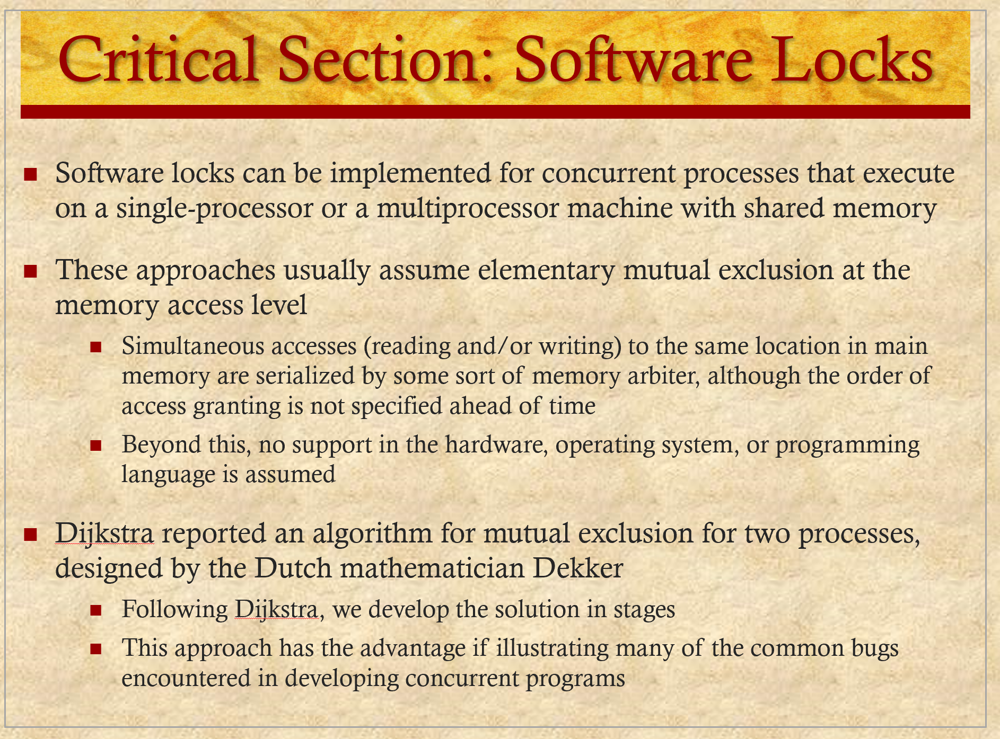

# ENEE447 Lecture 4  

> 1/31/24

### Chapter 5: Concurrency  

*No notes from lecture, will follow slides*  

  

  

  

As a first example, suppose that two processes, P<sub>1</sub> and P<sub>2</sub>, share the global variable `a`. At some point in its execution, P<sub>1</sub> updates `a` to the value 1, and at some point in its execution, P<sub>2</sub> updates `a` to the value 2. Thus, the two tasks are in a race to write variable `a`. In this example, the “loser” of the race (the process that updates last) determines the final value of `a`.

For our second example, consider two process, P<sub>3</sub> and P<sub>4</sub>, that share global variables `b` and `c` , with initial values `b` = 1 and `c` = 2 . At some point in its execution, P<sub>3</sub> executes the assignment `b` = `b` + `c` , and at some point in its execution, P<sub>4</sub> executes the assignment `c` = `b` + `c`. Note that the two processes update different variables. However, the final values of the two variables depend on the order in which the two processes execute these two assignments. If P<sub>3</sub> executes its assignment statement first, then the final values are `b` = 3 and `c` = 5 . If P<sub>4</sub> executes its assignment statement first, then the final values are `b` = 4 and `c` = 3 .

  

  

  

  

  

Any facility or capability that is to provide support for mutual exclusion should meet the following requirements:  

1. Mutual exclusion must be enforced. Only one process at a time is allowed into its critical section, among all processes that have critical sections for the same resource or shared object.  

2. When no process is in a critical section, any process that requests entry to its critical section must be permitted to enter without delay.

3. It must not be possible for a process requiring access to a critical section to be delayed indefinitely: no deadlock or starvation.
No assumptions are made about relative process speeds or number of processors.

4. A process remains inside its critical section for a finite time only.

  

There are a number of ways in which the requirements for mutual exclusion can be satisfied. One approach is to leave the responsibility with the processes that wish to execute concurrently. Processes, whether they are system programs or application programs, would be required to coordinate with one another to enforce mutual exclusion, with no support from the programming language or the OS. We can refer to these as ***software approaches***. Although this approach is prone to high processing overhead and bugs, it is nevertheless useful to examine such approaches to gain a better understanding of the complexity of concurrent processing. This topic was covered in the preceding section. A second approach involves the use of ***special purpose machine instructions***. These have the advantage of reducing overhead but nevertheless will be shown to be unattractive as a general-purpose solution; they are covered in Section 5.3. A third approach is to provide some ***level of support within the OS or a programming language***.

Software approaches can be implemented for concurrent processes that execute on a single-processor or a multiprocessor machine with shared main memory.
These approaches usually assume elementary mutual exclusion at the memory access level. That is, simultaneous accesses (reading and/or writing) to the same location in main memory are serialized by some sort of ***memory arbiter***, although the order of access granting is not specified ahead of time. Beyond this, no support in the hardware, operating system, or programming language is assumed.

Dijkstra reported an algorithm for mutual exclusion for two processes, designed by the Dutch mathematician Dekker. Following Dijkstra, we develop the solution in stages. This approach has the advantage of illustrating many of the common bugs encountered in developing concurrent programs.  

  

***First Attempt*** 

As mentioned earlier, any attempt at mutual exclusion must rely on some fundamental exclusion mechanism in the hardware. The most common of these is the constraint that only one access to a memory location can be made at a time. Using this constraint, we reserve a global memory location labeled `turn`. A process (P<sub>0</sub> or P<sub>1</sub>) wishing to execute its critical section first examines the contents of `turn`. If the value of `turn` is equal to the number of the process, then the process may proceed to its critical section. Otherwise, it is forced to wait. Our waiting process repeatedly reads the value of turn until it is allowed to enter its critical section. This procedure is known as busy waiting, or spin waiting, because the thwarted process can do nothing productive until it gets permission to enter its critical section. Instead, it must linger and periodically check the variable; thus it consumes processor time (busy) while waiting for its chance.

After a process has gained access to its critical section, and after it has completed that section, it must update the value of turn to that of the other process.

In formal terms, there is a shared global variable:
`int turn = 0;`

Figure 5.1a shows the program for the two processes. This solution guarantees the mutual exclusion property but has two drawbacks. ***First***, processes must strictly alternate in their use of their critical section; therefore, the pace of execution is dictated by the slower of the two processes. If P<sub>0</sub> uses its critical section only once per hour, but P<sub>1</sub> would like to use its critical section at a rate of 1,000 times per hour, P<sub>1</sub> is forced to adopt the pace of P<sub>0</sub>. ***Secondly***, if one process fails, the other process is permanently blocked. This is true whether a process fails in its critical section or outside of it.

The foregoing construction is that of a ***coroutine***. Coroutines are designed to be able to pass execution control back and forth between themselves. While this is a useful structuring technique for a single process, it is inadequate to support concurrent processing.

***Second Attempt*** 

The flaw in the first attempt is that it stores the name of the process that may enter its critical section, when in fact we need state information about both processes. In effect, ***each process should have its own key to the critical section so that if one fails, the other can still access its critical section***. To meet this requirement a Boolean vector flag is defined, with `flag[0]` corresponding to P<sub>0</sub> and `flag[1]` corresponding to P<sub>1</sub>. Each process may examine the other’s flag but may not alter it. When a process wishes to enter its critical section, it periodically checks the other’s flag until that flag has the value false, indicating that the other process is not in its critical section. The checking process immediately sets its own flag to true and proceeds to its critical section. When it leaves its critical section, it sets its flag to false.

The shared global variable now is

```
enum boolean (false = 0; true = 1);
boolean flag[2] = 0, 0`
```

Figure 5.1b shows the algorithm. If one process fails outside the critical section, including the flag-setting code, then the other process is not blocked. In fact, the other process can enter its critical section as often as it likes, because the flag of the other process is always false. However, if a process fails inside its critical section or after setting its flag to true just before entering its critical section, then the other process is permanently blocked.

This solution is, if anything, worse than the first attempt because it does not even guarantee mutual exclusion. Consider the following sequence:

P<sub>0</sub> executes the while statement and finds flag[1] set to false  
P<sub>1</sub> executes the while statement and finds flag[0] set to false  
P<sub>0</sub> sets flag[0] to true and enters its critical section  
P<sub>1</sub> sets flag[1] to true and enters its critical section  

Because both processes are now in their critical sections, the program is incorrect.
The problem is that the proposed solution is not independent of relative process execution speeds.  

  

***Third Attempt*** 

Because a process can change its state after the other process has checked it but before the other process can enter its critical section, the second attempt failed. Perhaps we can fix this problem with a simple interchange of two statements, as shown in Figure 5.1c.

As before, if one process fails inside its critical section, including the flag-setting code controlling the critical section, then the other process is blocked, and if a process fails outside its critical section, then the other process is not blocked.

Next, let us check that mutual exclusion is guaranteed, using the point of view of process P<sub>0</sub>. Once P<sub>0</sub> has set `flag[0]` to true, P<sub>1</sub> cannot enter its critical section until after P<sub>0</sub> has entered and left its critical section. It could be that P<sub>1</sub> is already in its critical section when P<sub>0</sub> sets its flag. In that case, P<sub>0</sub> will be blocked by the while statement until P<sub>1</sub> has left its critical section. The same reasoning applies from the point of view of P<sub>1</sub>.

This guarantees mutual exclusion, but creates yet another problem. If both processes set their flags to true before either has executed the `while` statement, then each will think that the other has entered its critical section, causing ***deadlock***.

***Fourth Attempt***  

In the third attempt, a process sets its state without knowing the state of the other process. Deadlock occurs because each process can insist on its right to enter its critical section; there is no opportunity to back off from this position. We can try to fix this in a way that makes each process more deferential:  
* Each process sets its flag to indicate its desire to enter its critical section, but is prepared to reset the flag to defer to the other process, as shown in Figure 5.1d.

This is close to a correct solution, but is still flawed. Mutual exclusion is still guaranteed, using similar reasoning to that followed in the discussion of the third attempt. However, consider the following sequence of events:

P<sub>0</sub> sets flag[0] to true.  
P<sub>1</sub> sets flag[1] to true.  
P<sub>0</sub> checks flag[1].  
P<sub>1</sub> checks flag[0].  
P<sub>0</sub> sets flag[0] to false.  
P<sub>1</sub> sets flag[1] to false.  
P<sub>0</sub> sets flag[0] to true.  
P<sub>1</sub> sets flag[1] to true.  

This sequence could be extended indefinitely, and neither process could enter its critical section. Strictly speaking, this is not deadlock, because any alteration in the relative speed of the two processes will break this cycle and allow one to enter the critical section. This condition is referred to as livelock. Recall that deadlock occurs when a set of processes wishes to enter their critical sections, but no process can succeed. With livelock, there are possible sequences of executions that succeed, but it is also possible to describe one or more execution sequences in which no process ever enters its critical section.

Although the scenario just described is not likely to be sustained for very long, it is nevertheless a possible scenario. Thus, we reject the fourth attempt.

  

***A Correct Solution***  

We need to be able to observe the state of both processes, which is provided by the array variable `flag`. But, as the fourth attempt shows, this is not enough. We must impose an order on the activities of the two processes to avoid the problem of "mutual courtesy" that we have just observed. The variable `turn` from the first attempt can be used for this purpose; in this case the variable indicates which process has the right to insist on entering its critical region.  

We can describe this solution, referred to as ***Dekker’s algorithm***, as follows:  
1. When P<sub>0</sub> wants to enter its critical section, it sets its flag to true.  
2. It then checks the flag of P<sub>1</sub>. 
    * If that is false, P<sub>0</sub> may immediately enter its critical section. 
    * Otherwise, P<sub>0</sub> consults `turn`. 
        * If P<sub>0</sub> finds that `turn = 0` , then it knows that it is its turn to insist and periodically checks P<sub>1</sub>'s flag. P<sub>1</sub> will at some point note that it is its turn to defer and set its to flag false, allowing P<sub>0</sub> to proceed. 
3. After P<sub>0</sub> has used its critical section, it sets its flag to false to free the critical section, and sets `turn` to l to transfer the right to insist to P<sub>1</sub>.  

Figure 5.2 provides a specification of Dekker’s algorithm. The construct parbegin (P<sub>1</sub>, P<sub>2</sub>, . . . , P<sub>n</sub> ) means the following:  
* Suspend the execution of the main program  
* Initiate concurrent execution of procedures P<sub>1</sub>, P<sub>2</sub>, . . . , P<sub>n</sub>  
* When all of P<sub>1</sub>, P<sub>2</sub>, . . . , P<sub>n</sub>  have terminated, resume the main program.  

[Great video on Dekker's algorithm](https://www.youtube.com/watch?v=MqnpIwN7dz0&ab_channel=SpanningTree)  

  

[Video on Peterson's solution](https://www.youtube.com/watch?v=r3Ma_4_vF2s&ab_channel=YunusSamilYavuz%28Alumni%29)  

[Great video comparing both approaches](https://www.youtube.com/watch?v=bMBwwzc5I68&ab_channel=IntroductiontoOperatingSystems)  

  

Dekker’s algorithm solves the mutual exclusion problem, but with a rather complex program that is difficult to follow and whose correctness is tricky to prove. Peterson has provided a simple, elegant solution. As before, the global array variable `flag`  indicates the position of each process with respect to mutual exclusion, and the global variable `turn` resolves simultaneity conflicts. The algorithm is presented in Figure 5.3.  

That mutual exclusion is preserved is easily shown. Consider process P<sub>0</sub>. Once it has set `flag[0]`  to true, P<sub>1</sub> cannot enter its critical section. If P<sub>1</sub> already is in its critical section, then `flag[1] = true` and P<sub>0</sub> is blocked from entering its critical section. On the other hand, mutual blocking is prevented.  

Suppose that P<sub>0</sub> is blocked in its while loop. This means that `flag[1]` is true and `turn = l`. P<sub>0</sub> can enter its critical section when either `flag[1]`  becomes false  or turn  becomes 0.  

Now consider three exhaustive cases:  

1.  P<sub>1</sub> has no interest in its critical section. This case is impossible, because it implies
`flag[1] = false`.  

2.  P<sub>1</sub> is waiting for its critical section. This case is also impossible, because if `turn = l` , P<sub>1</sub> is able to enter its critical section.  

3.  P<sub>1</sub> is using its critical section repeatedly and therefore monopolizing access to it. This cannot happen, because P<sub>1</sub> is obliged to give P<sub>0</sub> an opportunity by setting `turn` to 0 before each attempt to enter its critical section.  

Thus, we have a simple solution to the mutual exclusion problem for two processes. Furthermore, Peterson’s algorithm is easily generalized to the case of `n` processes

  

  

  

  

  

