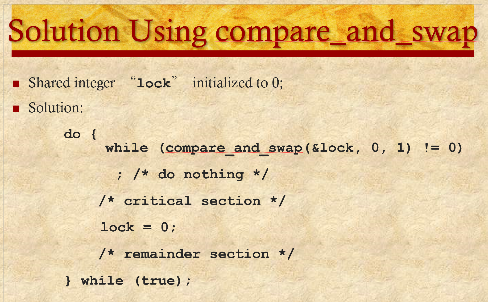

# ENEE447 Lecture 6  

> 2/12/24  

### Chapter 5: Concurrency (cont.)  

Several software-only sols
* No support from the HW  
* No support from the OS  

Incorporate code to code critical sections and have the code for entry and exit  

1 problem: Modern architectures can do out of order scheduling
* Sol: Have lock then go into critical section
    * HW does not understand this however  

   

Use software only solutions, but have a memory barrier
* Makes sure that neither the compiler nor the HW will reorder instructions across a certain memory value  

  

  

Only the HW can enforce the memory barrier. Given a function name here, but is usually HW  

  

Once we have a large number of threads, we need to account for all of them  

Memory barrier is very simple, but we need more support  

Disable interrupts:
* Nobody else can interrupt you, so you are guaranteed to reach desired position
    * Con: There may be a critical section bug
    * Con: Not useful in a multiple-core system

  

We are trying to implement the lock in HW  

  

  


We have memory, and the data we want to access in the critical section is highlighted (Shared buffer)  

Assume producer/ consumer situation  

We can have another shared variable at x

We make the lock: `test-and-set(x);`  

We write a 1 at x. Before doing so, it reads x and gives a return value. If the rv is 1, was not successful in setting BECAUSE there was already a 1 there  

Obj: turn a 0 into a 1  

Then, it is up to the programmer to check this return value  

```
// Return value
rv = 1;

// Test the lock
while(rv)
    rv = t-n-s(x);

*Critical section*

// Set the lock
x = 0;
```  

[Good example of test and set](https://stackoverflow.com/questions/120937/what-is-test-and-set-used-for)

As soon as we get a 0, we know we have succeeded in getting the lock and we can proceed

Test and Set uses 2 memory instructions (load and store)  

Does this guarantee mutual exclusion?
* Yes, because is is an atomic operation. Specifically, mutual exclusion is guaranteed in TSL mechanism since a process can never be preempted just before setting the lock variable. Only one process can see the lock variable as 0 at a particular time and that's why, the mutual exclusion is guaranteed. ([Source](https://www.kdkce.edu.in/pdf/Unit%20No%205%20O.S%20Notes.pdf))

If nobody is trying to enter, x = 0 and there is no waiting for the lock after one process has used it  
* Does this avoid starvation? 
    * Not really

What happens if 2 processes send test and set instructions at the same time? 
* Bus arbiter will pick one of them
* No systemic bias, but we cannot say there will be no starvation since we have no idea how many processes there are, how long they have been waiting for

Test and set by itself will not cause deadlock
* Deadlock comes from people misusing it  

  

  

Generalization for test and set
* May have bigger integer you want to use instead of just 0 and 1 that we saw in test and set  

  

For simple mutual exclusion, 0 and 1 are all we need  

  

  

SW: Hard to expand to large number of threads

  

Spin locking is sill happening  
* OS dos not know hat the process needs the lock, thus wasting cycles  

  

Updates to atomic variables are in of themselves atomic  

  

  

  

  

Say that now x is a semaphore  

Both the `semWait` and `semSignal` are system calls
* Cannot as a programmer directly do something to the semaphore  
* Can only wait and signal  

  

If the semaphore is initialized to 1, the first process to wait gets it and decrements it and continues

If another one comes along and tries to get it, one way to keep track of how many people have tried to get the semaphore is to continue to the negatives  

If multiple processes are waiting on the x, there is no guarantee which will get it, leading to starvation  

  

  

  

This ^ is limited to one process at a time  

  

  

  

  

  

Software only solutions were originally in user mode only, but can alo be done in kernel mode  

  

  

  

  

`in` and `out` are the pointers. 
* `in`: producer needs to insert info here
* `out`: consumer needs to take out info here 

Assume infinite buffer (no overflow)  

  

These are important problems for the exam
* Usually will be given an incorrect solution, need to explain issue and correct it  

s here i for mutual exclusion
delay is for the consumer to wait  

n in this context should have been initialized to 0  

Produce outside of the critical section. Once done, we want to insert into the critical section(`semWait`) once we have the lock, we append into the buffer and increase n. We use n to check 

  

The issue here is accessing n outside of the critical section  

Lines 18 - 21 demonstrates this issue 

  

If you move the check line, and its is an empty buffer, it will get blocked but it holds the mutual exclusion lock (`s`), and thus we will end up in deadlock  


