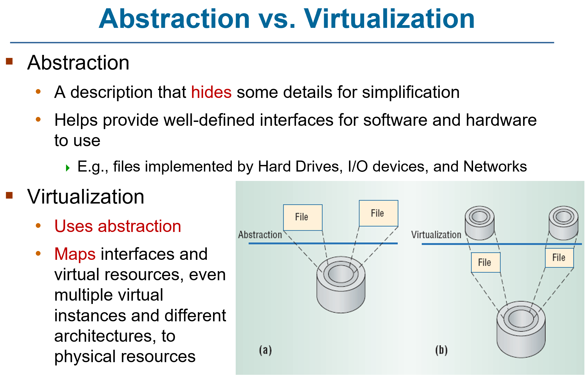
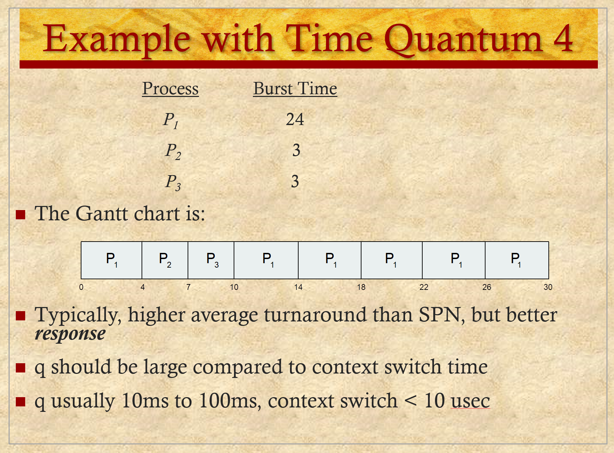

# ENEE447 Lecture 3  

> 2/12/24  

### Chapter 5: Concurrency (cont.)  

Several softare-only sols
* No support from the HW  
* No support from the OS  

INcporporate code to code critical sections and have the code for entyr and exit  

1 rpblem: Modern architectutrs can due out of order shceduling
* Sol: Have lock then go into critical section
    * Hw does not understand this however  

  

Use software only solutions, but have a memory barrier
* Makes sure that niether thecompiler nor the HW will reorder instructions across a certain memory value  

  

  

ONly the HW can enforce the memory barrier. Givn a funciton name here, but is usually HW  

  

OCne we have a large number of threads, we need to accout for all of them  

Mmeory barrier is very simple, but we need more support  

Disable interrupts:
* Nobody else can interrupt you, so you are guaranteed to rach desired position
    * Con: there may be a critical section bug
    * Con: Not useful in a multiple-core system

  

We are trying to implement the lock in HW  

  

  

We have memory, and the data we want to access in the critical section is highlighted (Shared buffer)  

Assume producer/ consumer situation  

We can have another shared variable at x

We make the lock: `test-and-set(x);`  

We write a 1 at x. Before doing so, it reads x and gives a return value. If the rv is 1, was not successful in setting BECAUSE there was already a 1 there  

Obj: turn a 0 into a 1  

Then, it is up to the programmer to check this return value  

```
// Return value
rv = 1;

// Test the lock
while(rv)
    rv = t-n-s(x);

*Critical seciton*

// Set the lock
x = 0;
```  

As soon as we get a 0, we know we have succeded in getting the lock and we can proceed

test and set uses 2 memory instructons (load and store)  

Does this guarantee mutual exclusion?
* Yes, becuse is is an atomic operation ???

If nobody is trying to enter, x = 0 and there is no waiting for the lock after one process has used it  
* Does this avoid strvation? 
    * Not really

What hapens if 2 processes send test and set instrucitons at the same time? 
* bus arbiter will pick one of them
* no systemic bias, but we cannot say there will be no starvation since we have no idea how many processes there are, how llong they have been waiting

test and set by itself will not cause deadlock
* Deadlock comes from people misusing it  

  

  

Generalicagtion fo test and set
* May have bigger interger you want to use instead of just 0 and 1 that we saw in test and set  

  

For simple mutual exclusion, 0 and 1 are all we need  

  

  

SW: Hard to expand to large number of threads

  

Spinlocking is sill happening  
* OS dos not know hat the process needs the lock, thus wasitng cycles  

  

Updaets to atomic variables are in of themselves atomice  

  

  

  

  

Say that now x is a semaphore  

BOth the semWait and semSignal are system calls
* Cannot as a programmer directly do something to the semahpore  
* Can only wait and signal  

  

If th semaphore is intied to 1, the first process to wait gets it and decrements it and continues

If another one comes along and tries to get it, one way to keep track of ho maby people have tried to get the semaphore is to continue to the nagatives  

If multiple processes are waitng on the x, there is no guarantee which will get it, leading to starvation  

  

  

  

This ^ is limited to one process at a time  

  

  

  

  

  

Software only soultions werre origianlly in user mode only, but can alo be done in kernel mode  

  

  

  

  

in and out are the pointers. 
* in: producer needs to insetr info heere
* out: consumer needs to take out info here 

ssume infinite buffer (no overflow)  

  

These are important problems for the exam
* Usually will be given an incorrect solution, need to explain issue and correct it  

s here i for mutual exclusion
delay is for the consumer to wait  

n in this context should have been initialized to 0  

Produce outside of the critical section. Once done, we want to insert into the critical section(semWait) once we have the lock, we append into the buffer afnd increase n. we use n to check 

  

the issue here is accessing n outside of the critical section  

18 - 21 demonstrates this issue 

  

If you move the check line, and its is an empy buffer, it will get blocked but it holds the mutual explusion lock (s), and thus we will end up in deadlock  

