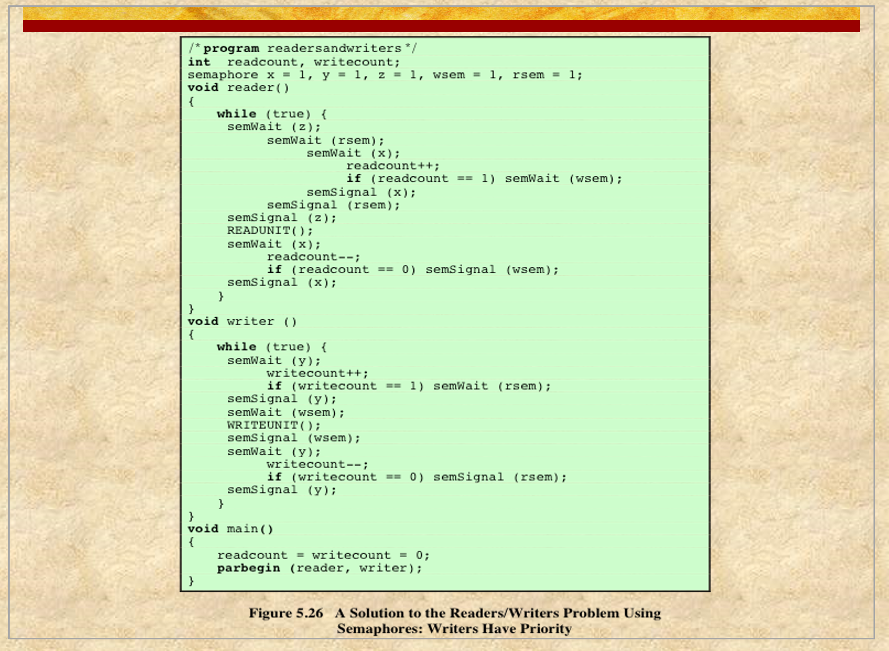

# ENEE447 Lecture 7  

> 2/14/24

### Chapter 5: Concurrency (cont.)

Last time: inter-thread synch
* Using scenarios s/a consumer producer problem

Infinite buffer scenario
* Never run out of buffer space  

Producer need not check for full buffer  

Today: finite size buffer (Bounded buffer)  

  

Now, producer need sto check whenever the buffer is full (will need to wait if so)

  

This solution works. We don't use any variables, instead using semaphores. Also need to check for full buffer, so we have an additional semaphore (`e`) which will tell us how many empty slots there are.  

As items are added, e is decremented  

We want to make sure that the following four things are  
1. Mutual exclusion
    * Append is the critical section, and we are acquiring and releasing before and after the critical section respectively 
2. Progress
    * Depends on how the semaphore is implemented
        * Random: Possibility of starvation
        * Queue: No 
    * If nobody is waiting, we continue
3. Deadlock
    * `e` is never held at the same time as the other thread would. Therefore, no deadlock
4. Starvation  

Shared data base with readers and writers  

Readers only read, therefore we can allow concurrent readers 
* No mutual exclusion needed

Writer could be reading as well as reading in order to update  
* If writer is in CS, no one else can be in the same section at the same time  

  

  

Looking at the writer code, we make a wait on `wsem`. 
* Binary semaphore for mutual exclusion
* If successful, will go in and write, then signal
    * Guarantees only one writer can go in at a time  

Reader does a semWait on `x`. IF it got x, will increment readCount

Even though we allow multiple readers at a time, we do not allow multiple readers to update the reader count
* Avoid data race by updating serially

ONly the first reader needs to hold off on the writers writing. The others merely read.  

x will ensure mutual exclusion within the readers  

1. Mutual exclusion between, writer and writer, and writer and reader
    * Writers have mutual exclusion between themselves
    * Writers and readers are also. We only allow readers read or write one after the other, never at the same time, thus guaranteeing that there is mutual exclusion  

2. Progress
    * If someone wants to go into the CS, and there is no one there, is this allowed?
    * ye lol  

3. Starvation
    * If multiple threads are waiting, is there a possibility some threads may end up being overlooked? 
    * Yes, writer needs to wait for not only the current readers but also for the future readers 
        * Too many readers == writer starvation  
        * Sol: Have a way to indicate that a writer is waiting, and act accordingly
            * Con: Too many writers == Readers starve instead  
        * No easy solution
        * Some systems (Testudo) avoid this by going down and allow all updates

  

For now, lets assume there is no z variable and analyze  

The x sema is for mutual exclusion  

However, we have an rsem this time
* Servers same purpose as lsem to writer  

For the writer, we have added the write count.  

Does not guarantee no starvation  

Now, lets talk about z

z was added in order to improve the situation

Without z, all the readers tht are coming afterwards will end up queuing at rsem. Instead of letting a tug-of-wat with the rsem in bout the writer and reader, if it is not using the queue, the writer may get to go.  

  

Good table for analyzing the code  

Dining philosophers PagMan  

we can think of each philosopher as an individual thread, and the resources being the chopsticks  

Naive method: A philosopher, when wanting to eat, first gets left, then right  

Mutual exclusion: Sat  
Progress: Sat  
Starvation: Not sat with weak semaphore  

Deadlock problem: All philosophers try to eat at the same time and they are each waiting for the other to release a chopstick  

  

Naive method code  

Problem is, we have 5 resources (chopsticks) and in order to prevent circular wait, order them 1-5. If we ensure that every philosopher will know which 2 chopsticks they need, they will pick them up only in one order. This relieves the circular wait issue  

  

  

Other situations where deadlock is possible  

Since P0 and P1 are both trying to get the same lock at the same time, it is possible to have deadlock  

One solution in th next chapter is to allow deadlock since it is very unlikely  

  

"Not a problem with semaphores, just bad code" -Franklin, 2024  

Signal before wait means that we have +1 available slot on the semaphore, or it does nothing at all
* results in no mutual exclusion

double wait == deadlock  

  

Before, with semaphores, we have shared data between 2 processes. Any edits to this shared data is CS. Thus, we'd need to use some kind of lock for it  

With monitors, we would put the hared memory and the CSs as a shared object. This means that we do not need to acquire a lock. instead, P0 keeps going and if it need the object, it executes a method for the object. This would be handled by a library  
* This will cause overhead, however  

  

*Will finish chapter on Monday* 
