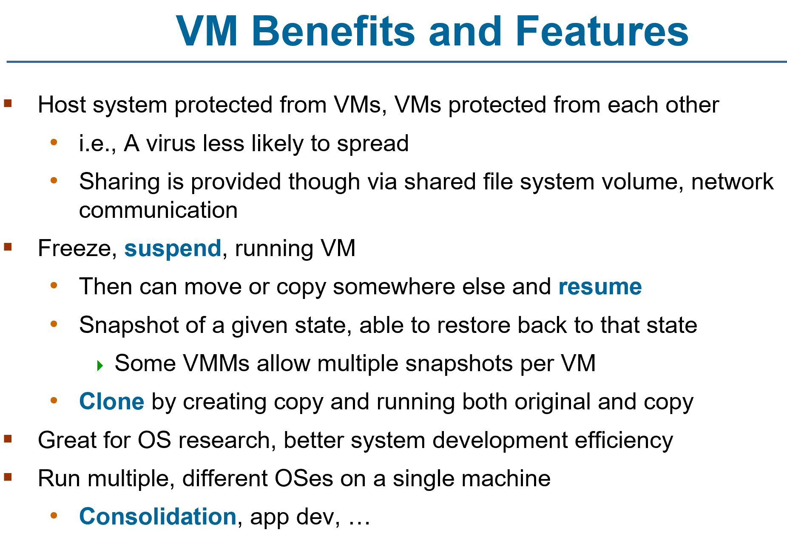
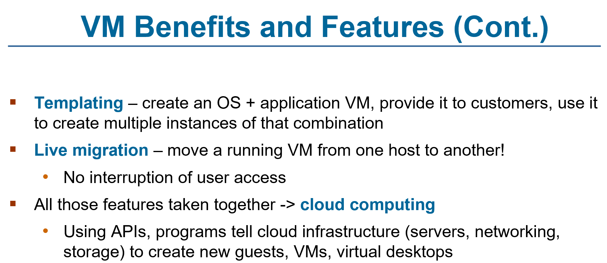
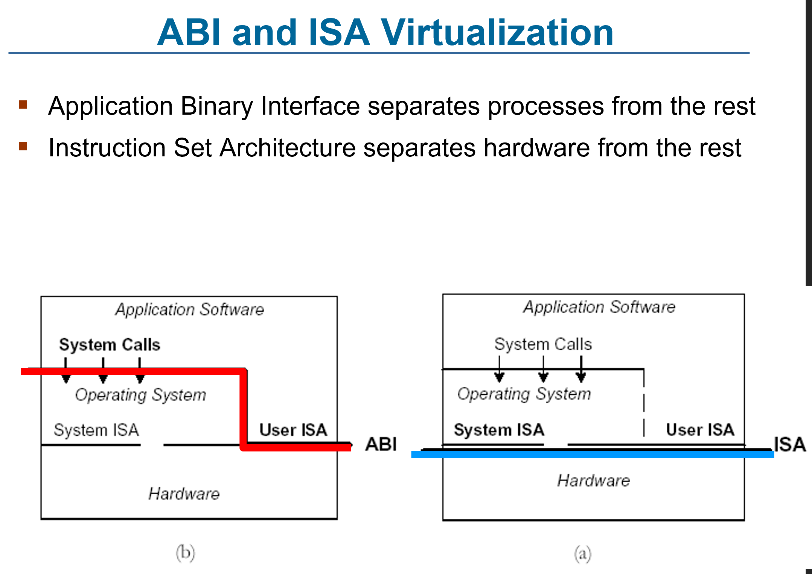
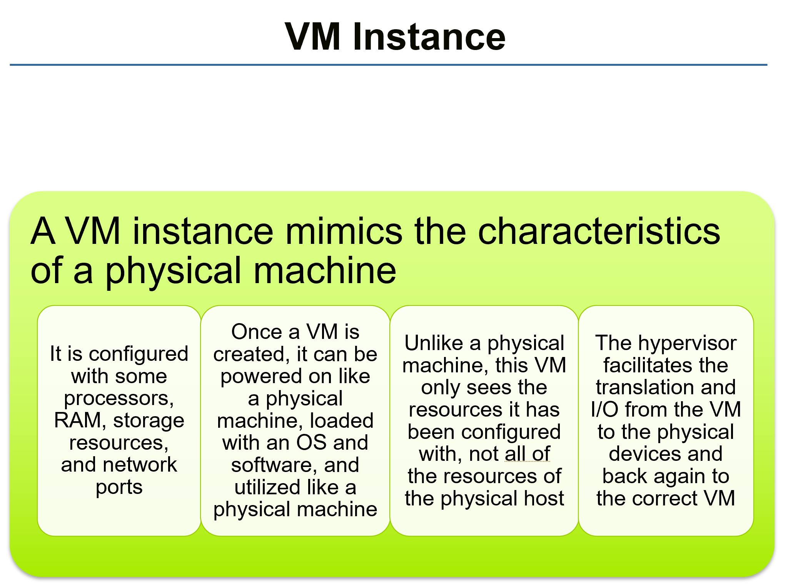

# ENEE447 Lecture 4  

> 2/14/24

### Chapter 5: Concurrency (cont.)  

Last time: Looking at monitros and semapohores  

Drawbak of semaphores: Everytime we need to use them, we need to make a call to the operating system  

Monitors are OO approach
* makes it easier 
* Less parallelism  
* More overhead  

  

In the caee of prod-cons, 2 main methods
* Put item in
* Take item out

In the case of the monitor, there will be 2 gray rectangles in the middle part  

Producer code ned not worrry whether it can or cannot enter  
* Same thing for consumer  

  

Application programmer doesnt need to worry about this ^ implementation  

Monitors releives the programmer from doing this ^   

MOnitor allow youto specify new variable type: Condition variable  

  

These are used for signalling, and we may signal from one to the other  

  

Will not be asked to analyze/ write with monitors in exam! <sub>only thing i got right on the first exam last time...</sub>  

  

Monitor has 2 functions: append and take  

  

  

  

  

***Edit image names!!!***
  

Shared memory model we saw could be made explicit, but it is usually implicit (semas used to ensure synch)  

Message passing means that only the I/O is shared/ connected (explicit)  

Explicit communication: No need to worry about CS  
* Con: All communication needs to go thru OS  
* Each process needs to make packet and sent to OS, leading to overhead  
    * Thus, we dont really send small messages  

Message passing does not restrict us to one system, we can communicate all thruought a network  

  

Due to having a source and destination, we call this explicit  

Shared memory does not have a destination. Whoever has caccess can read it  

Blocking send: This process did a send, should it wait until it has been recieved? 
* If it can continue, its nonblocking
* If not, called blocking  

Blocking recieve means we need a message in order to proceed 

Most common protocol: Nonblocking send, blocking recieve  

  

In main, howevr many slots we have, that many null sends were made, giving us our capacity  

Clue's in the name! If we get a "mayproduce" message, we know we may start producing. Consequently, when we produce, we send a "mayconsume" mesage to know we may consume  

  

   

with locks: 

```
acquire lock
cs
release lock
```  

with Transacitonal memory:  

```
P1              P2
...             ...
Transaction     Transaction
...             ...
```
Keep log as to when a transaciton started, and when it completed  
* Done for each process

Time stack: Log will keep track of transaction start and completion times using timestamps

When a transaction completes, you cannot just keep going. Must commit the  transactoin. 

At the tim of commitment, a check will be done using the log etc. to check for any mutex conflicts  

Rolling back occurs whenever there is a conflict, ad we have to go back  
* At every update that is done, the log will keep th previous and new value  

Backing off, then waiting for some random time  

Transacitonal memory is useful if you think conflicts will not be likely ???  

TM is an idea from the database community  

OpenMP is more standard for parallel programming  

  

Enabling/ disabling preemtion == disabling interrupts  

Spinlock: Instead of request going into memory, relies on cache coherence and only checking there  
* Avoids creation of traffic  

Yes, it is a busy wait, but does not cause traffic  

  

  

  

This is an important chapter for exam 1!!!  

  

We will need to know how to analyze the scenarios circled. Given an incorrect solution, we must find the issue, explain it, and give a correct solution and explain why it solves the issue  

### Chapter 9: Uniprocessor scheduling  

Scheduling: 3 levels
* Long term
* Medium term
* Short term

  

Long-term: Whether to create a new process NOW :lightningbolt:

Medium-term: " " swap out or in some processes

Short-term: Which process or KLT to run next  
* KLT: Kernel Level Thread  

  

  

  

  

Scehduler makes the decision, and the dispatcher does th actual switching  

  

  

  

What should a short-term scehduler be looking at?  
* Fairness: Say 5 processes ebter system in some order. Whoever came first, goes first, etc. 
    * OR: What % of the CPU time are each process getting? Is one getting more than the others?  
* Throughput: How many proceses are finishing in unit time? 
* Priorities: 