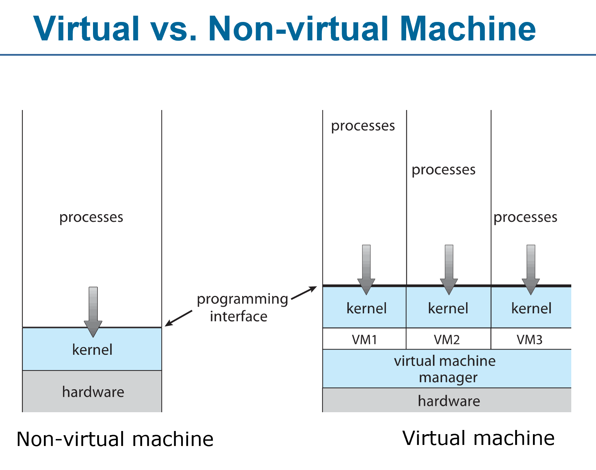
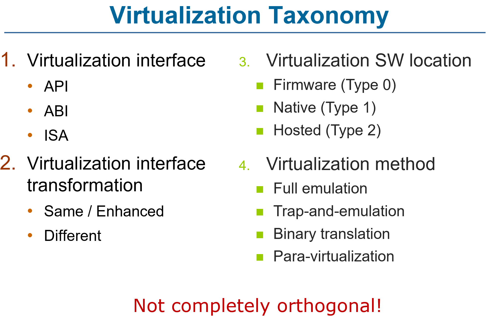
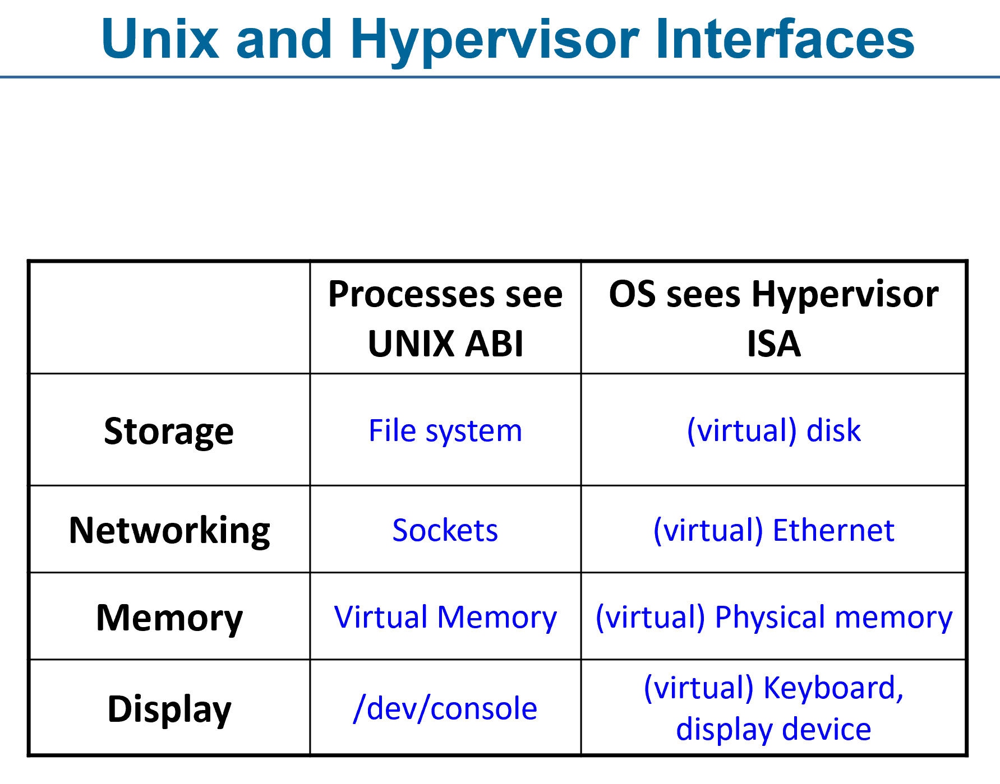
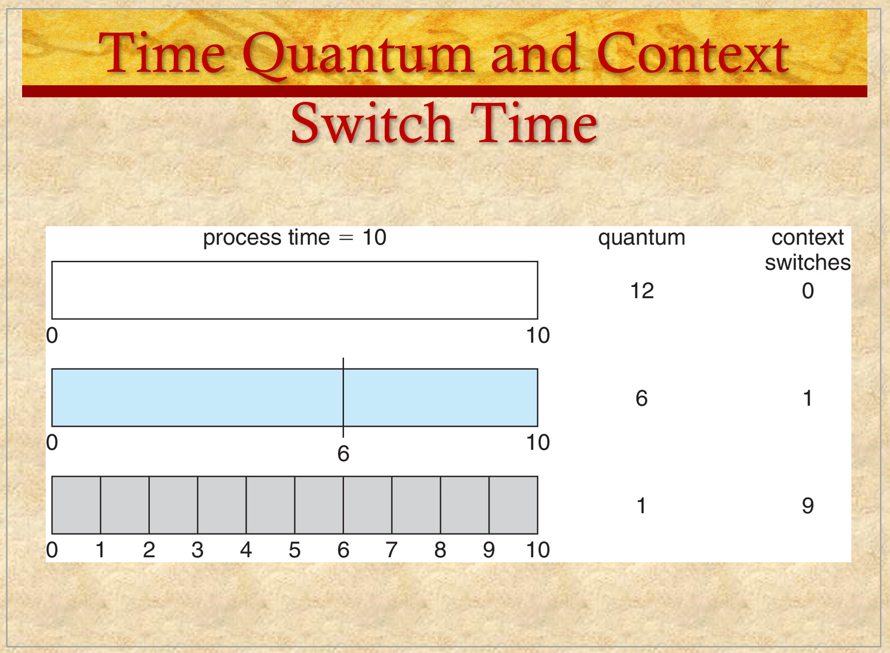
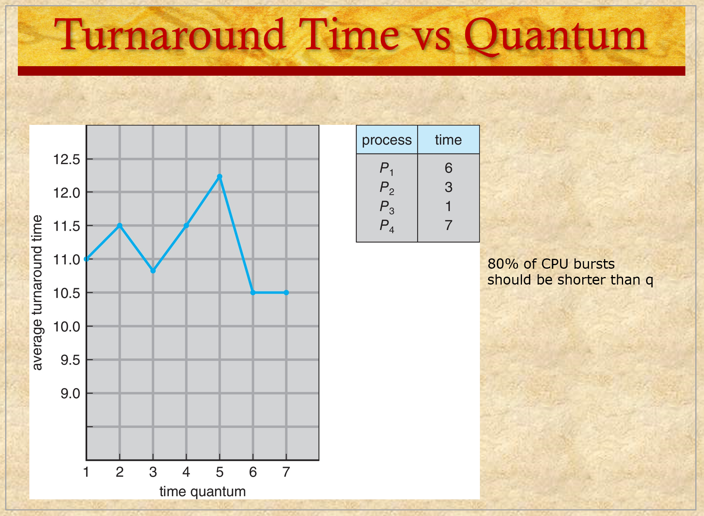
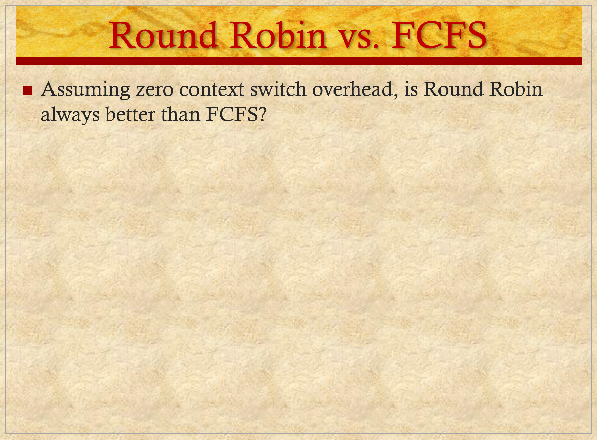
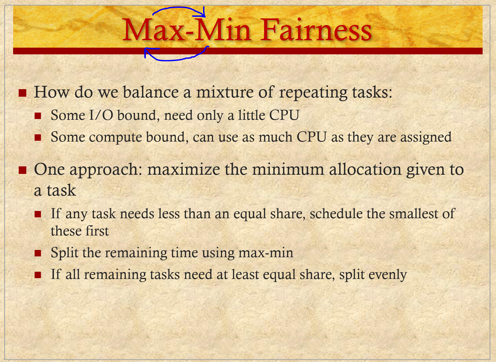
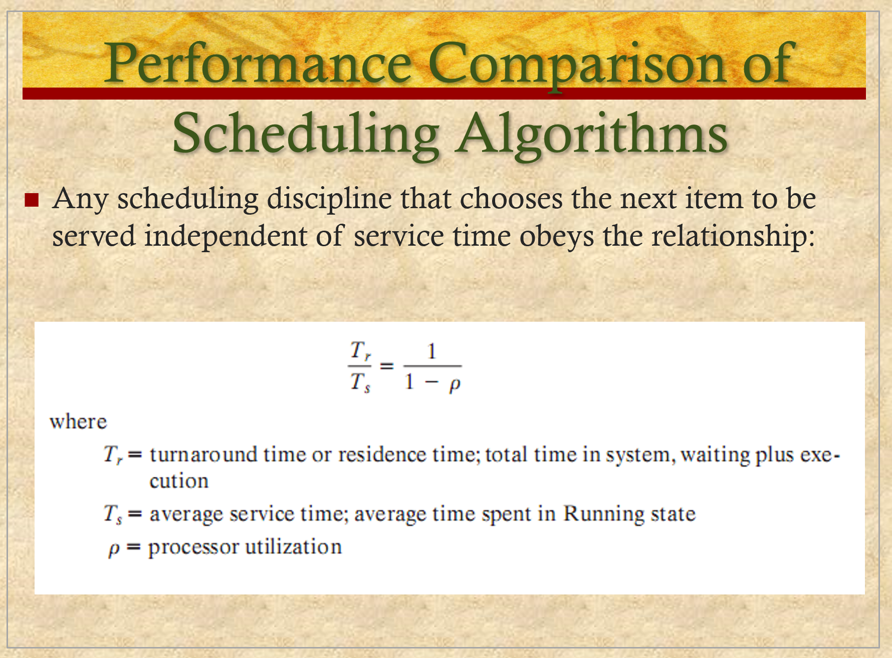
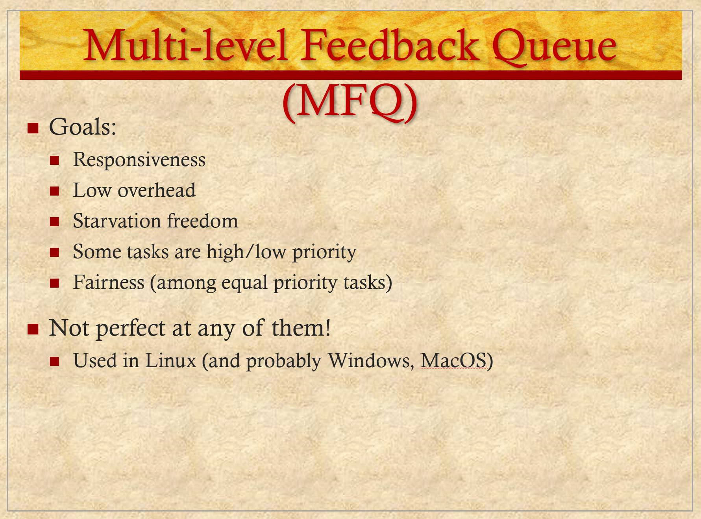
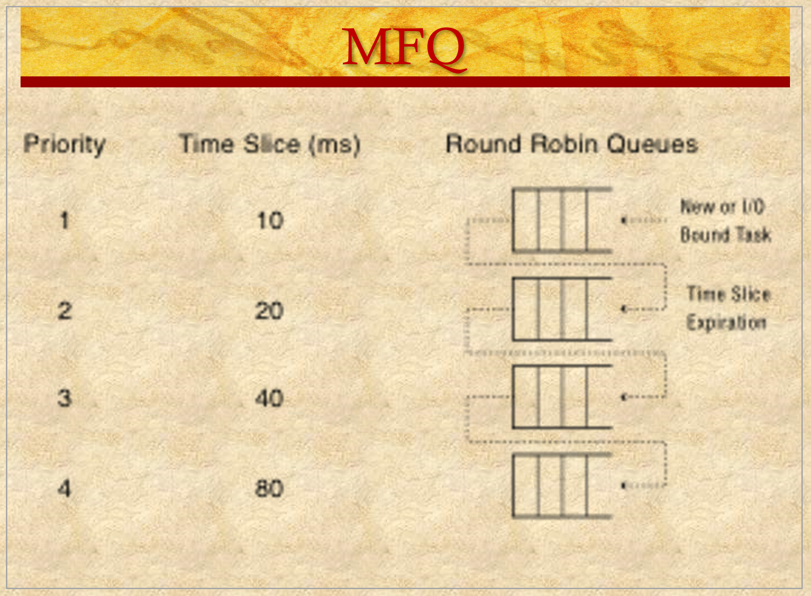

# ENEE447 Lecture 9 

> 2/21/24

### Chapter 9: Uniprocessor scheduling (cont.)  

  

Batch system: primarialy computation-intensive programs
* No human controller  
* Increse CPU utilization  

Trunaround time: From where a job is submitted to when it is completed  

Batch sytemsa re nonpreemptive  

  

First 2 ar nonpreemptive  

  

We assume that we know what time ech will take  

  

This is a Gantt chart for scheduling tasks  

x axis is time, y axis is the process  

ith this, we can calculate avg. wait time, turnaround time, etc.  

  

  

  

  

FCFS resutls in convoy effect: Longest job holds everyone up  

  

  

As we can see, the shortest proces next method will give us the smallest average wait time, since the wait times for all of the small jobs are shorter  
* Increasess thruoughput  

Downside: If there are a lot of processes, longer ones will wait for more time  

SJF needs to know the service time. This is difficult in practice
* WHat is the length of the CPU burst?  

OSs will use estimations in this case  

  

We only have imperical data to work on, so we use that for our predicitons  
* How far in the past should we go to make a prediciton?  

Go to far, and you risk using stale data  

t = actual length 

tau = prediction  

  

  

If alpha is higher, more recent ones are given higher importance, thus past times hold less precedence
* vice versa  

  

We can see the aforementioned claim here by how quickly the "importance" tapers off depending on which alpha is chosen  

  

  

  

Every time something becomes ready, we stop and make a calculation  
* This is why its preepmtive  

  

Optimal in turnaound time assuming context switch time is 0  
* May result in starvation 
    * If we have a long job, may constantly be overlooked
* Attempts to remedy this by taking in consideratoin how long a process has been waiting
    * Older process will be given a higher priority over time  

  

In SPN, a shortr process comes after a longer one. Why?  
* Its nonpreemptive, and at time 3, C had not yet arrived. Thus, we could not schedule it  

May be asked to draw these on exams. Keep this detail in mind!!  

Shortest remaining time: since B had 5 left, and C 4, C tkes precedence and starts running  

  

From batch system, we now move onto interactive systems  

  

End-user has more control over the system  

In practice: multiple queues, round robin  

All of these are preepmtive    

  

Everytime a process gets inteerupted in RR, it will be placed at the end of the queue  

Time between which a process starts and NEEDS to be switched in RR is called the time quantum  

  

  

Context switch due to RR scheduling  

  

In the forst scenario, it acts like shortest ??? next  

If the time slice is longer, it acts similar to FCFS  

  

  

  

From the slides:  

> Everything is fair, but average response time in this case is awful – everyone finishes very late!  In fact, this case is exactly when FIFO is optimal, RR is poor.  

> On the other hand, if we’re running streaming video, RR is great – everything happens in turn.  SJF maximizes variance.  But RR minimizes it.  

RR is helpful when you have mixed type workload  

  

  

  

INstead of keeping one queue as we have seen up until now, we keep multiple  

Split the ready queue into multiple  

Many systems like Linux implement this approach  

We can migrate processes from one queue to another  

Not much theory behind which queue a process should go to etc.  
* People just choose whatever they feel is best for their needs  

  

Management of queues is done via some kind of feedback  

  

2nd main bullet is not necessarilay true  

  

Lower number == higher priority  

  

we use some kind of analytic model to simulate what would happen given a certain algorithm in a system  

One such model iis the queueing model  

  

Processor modeled as a server  

In this example, we have servers, queues, and interconnections that tie things together  

HOw does this eventually help us model the sysstem?  
* Differen queue models
    * E.g: M/M/1
    * New processes at fixed rate (Lambda)  
    * Process time (t) 
    * Every 1/lam == new process, we can calculate quite easily

Poisson arrival  

Assume t to be exponentially distributed, use some math and tell the avg. time a process will wait for

*Will continue tomorrow*