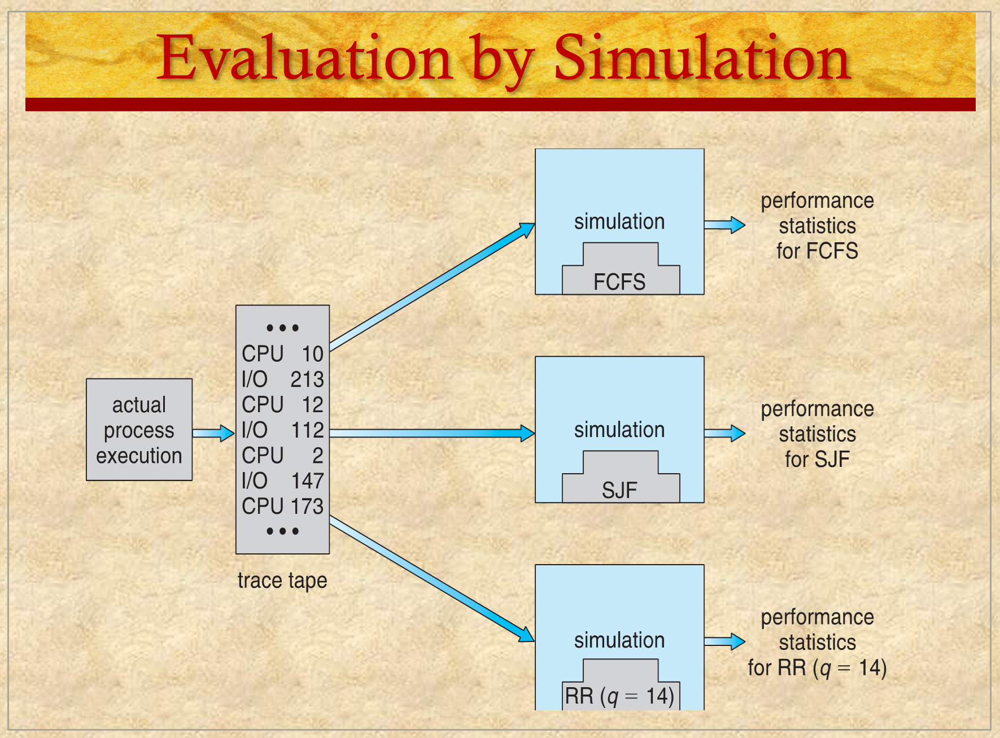

# ENEE447 Lecture 9 

> 2/26/24

### Chapter 9: Uniprocessor scheduling (cont.) 2 electric boogaloo  

Last time: How we can figure out if a scheduling algo is good
* Queueing theory
    * Look at what are the resources where the processor is spending time  

Lambda: arrival time
Mu: processing time  

[M/M/1 queue](https://en.wikipedia.org/wiki/M/M/1_queue)  

Advantage of using queueing model: Can come up with expression and immediately know arrival and times  

Con: They are all approximations  
* How likely are processors to have Poisson distribution?
    * Unlikely  

Assumption for this model is questionable  

Other models
* Petri Nets  

  

  

Instead of using math, you simulate the actual model  
* Yields more accurate results

Cons: Mor time needed to spin them up and consume more time  

  

2 types of simulation:  
* Trace-driven
    * Run it once and collect the trace. 
    * e.g when a process started, how much time it took, why did it stop, etc. 
* Execution-driven  

Above is trace-driven  

Now, when we do simulations for different models, we know what conditions the processor was in due to the trace tape  

We simulate the actual system using FCFS  

Execution-driven takes more time since you typically run the simulation many times with differences between them  

Trace vs. Exec?
* Trace as much as possible
* If you think the trace is strongly dependent on the scheduling algo, may not be a good ides
    * When running the algorithm, it depends on the trace tape  
    * If you change the algo,and trace is very different  
    * If trace remains consistent across algos, its good

  

  

Multiple queues based on priority. Was using preemption (necessary with round robin)  

  

Processes where grouped in 2
* Time sharing
    * Take time from a shared pool 
* Real-time
    * If you have a deadline you try to schedule it first

Priority number low == high priority  

If a process has higher priority and gets more $q$, may impact other lower priority tasks  

  

Unix allowed end users to "nice" their processors (specify priorities)  

  

  

  

Within each category there are sub categories  

  

  

  

If tasks are variable in size, RR veri gud  

If not, veri bad  

*End of chapter 9*  

### Chapter 10: Multiprocessor, Multicore, and Real-Time Scheduling  

In the first half, we will be looking at multiprocessor  

Real time scheduling will be more relevant on the exam  

For multicore: How to extend unicore scheduling to multicore  
* Can get messy 

  

Multi core: Multiple corse on the same chip  
* Think of them as multiple processors on a single chip  

Multi processor: May be multiple cores, or me have multiple processor chips  

Big deal: multiple cores or multiple processors mean we need communication between them  
* Depending on where the communication takes place, latencies come into play  

First one could also refer to multiple computers connected via LAN  

Heterogenous system: Some processors are specialized  
* Scheduling becomes easier because OS needs to know the particular processor has specific needs, and therefore can schedule accordingly  

  

Inter thread communication
* When you have multiple cores, and trying to schedule, need to consider nature of communication between threads due to real concurrency.  

If some thread needs something from another, good for the OS to know this  

  

  

  

  

  

We want to have a single queue where everyone queues up based on availability  

Single queue round robin may return to beginning of queue WHEN THERE IS ONLY ONE  

When there are more than one, which one should it go to?  

Cores can have multiple queues with their own independent priorities  

 

  

  

From OS POV, bullet 1 is easiest  

  

  

  

Curious: So different processors (Intel, AMD, etc.) running same OS (Windows) will have vastly different approaches?  

2nd sub-bullet not great for performance acc. to prof  

  

  

With only single core, only need worry to put the process in the back of the queue  

Now, need to decide which queue to place it in  

NUMA: **N**on **U**niform **M**emory **A**ccess  

OS needs to decide how to schedule the threads on each processor  

Modern CPUs (AMD, Intel) have multi cores and multi threads  

  

  

Need to pick 3 and assign them. How do we do this?  

  

Processor affinity
* Say T1 already ran on P1. P1s cache may still have T1s info in cache, and therefore T1 has affinity for P1
    * Too much, and all Ts go to one processor, may cause slowdown. P2 and P3 will remain idle  

Processor load: Load balancing  

  

Dynamic assignment: RR, FCFS, etc. (Ones that we've seen before)  

  

  

  

Global: Good for load balancing  
* Wherever a processor becomes free, can immediately take from queue  

  

  

  

2n bullet: Say T1 ran on P1 and gets preempted. When its ready once again, may go on different processor
* May be offset by affinity  

  

NP problems :aware:  

  

If you have 10 threads, you try to group them into a gang and schedule them all at once  

*Will continue next class*