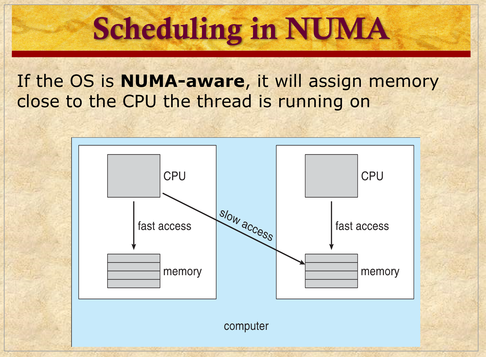
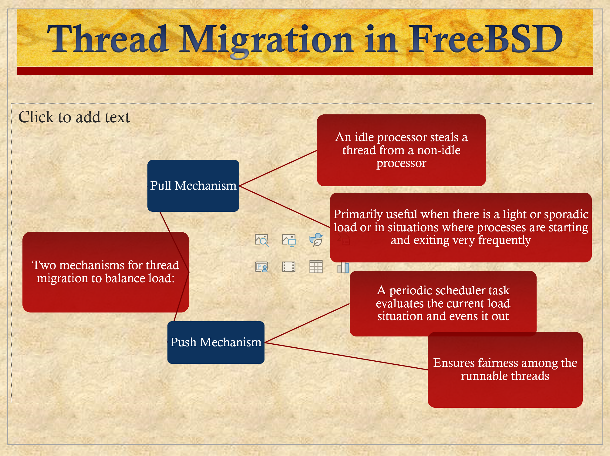

# ENEE447 Lecture 11  

> 2/28/24

### Chapter 10a: Multiprocessor and Multicore Scheduling (cont.)  

***TODO: Add slides for 10b***


Material for midterm 1:  
* **Will** have topics up to chapter 9
    * This includes ch. 6 (deadlocks), which we haven't covered yet
* 10a & 10b may or may not, will tell us later  
    * Most likely not tho

In-class review scheduled for March 11  

Last time: Multicore scheduling  

Very difficult to have timing charts for multicore systems  

Many algos, but 4 major concepts
* Load sharing: Give more importance to loads
    * Make sure load is distributed evenly
* Gang scheduling
    * All the threads from the same process that should be working together should ideally be scheduled together
* Dynamic
    * How many threads should be spawned given the available resources?
* Dedicated processor assignment
    * Completely allocating a core to a process

  

^ in practice, global queue is made of multiple queues  

Take a decision by looking at all the queues  

  

  

  

  

Prof isn't sure about the 2nd bullet in advantages, hence the ??

If you have priorities, you may actually need centralized scheduler  

  

Uniform Memory Access (UMA): symmetrical  

P1  P2      ...     PN  

C1  C2      ...     C3

M   M       ...     M   
|   |               |
-----------------------  < Interconnect

Memory is partitioned across processors  

If T2 is assigned to the first memory module, makes sense to assign it to P1 where the memory is already stored there  
* Compiler also needs to know this when allocating memory  

  

Every time wwe bring in a task, it's data is in a separate cache, and is therefore slowed down  

  

Last bullet demonstrates load balancing  

  

  

Separate queue associated wih each processor

3rd bullet: what if one processor finishes early?  

  

  

An idle core will pull work from someone else (pull migration)  

  

  

 

```
             ----- Thread
            /  
Process-----  
            \  
             ----- Thread
```
  

  

  

Motivation slide for next slide  

There is a point of diminishing returns with adding more threads  
* Why?  
    * Context switch, and communication lag  

  

  

  

Here, there are more cores, which in turn are clustered via their L2 cache  

Processor affinity is a 2 level thing here, since if we cant schedule on the exact same processor a thread was running on, we can at least try to schedule it on its neighbor  

  

Multiple threads to a processor. The HW on the processor will decide whether to run them simultaneously or with Fine-grain control  

  

  

  

  

  

  

### Chapter 10a: Real-Time Scheduling  

No slides for this next part :(  

A correct program not only give correct answers but within stipulated deadlines  

Important to have high predictability  

Many RTS do not incorporate gth strategies for speeding up performances we used before  
* Based on some kind of prediction  
    * Most recently used data is likely to be used again, etc.  

Gives high performance most of the time, but not all of the time
* unacceptable in RTS  

We therefore don't use a lot of predictions in these kinds of systems  

In RTS, most of the tasks are known in advance  

Not everything is predictable, but we wont do arbitrarily different tasks  

Hard RT task
* If you did not meet the deadline are very bad<sup>TM</sup>
    * Air traffic control

Soft RT task
* Bad to miss deadline, but not as bad <sub>his words, not mine</sub>  
    * Google maps taking forever  

Sporadic tasks
* Do not run continuously for a long time  

May be periodic or non-periodic  

In general, for a periodic task, we set the deadline as the beginning of the next instance  

We have a period for which we must finish our task within.  

RTS requirements:  
* Determinism
* Responsiveness 
* User control
* Reliability
* Fail-soft operation

Determinism: How long does the RTS take to acknowledge an interrupt  

Not really worried about determinism in this class
* Must have board in order to care about this  

Responsiveness: How long, after acknowledgement, the RTS takes to service the interrupt  
* Together with determinism, makes up responsiveness

User control  

Reliability   

Fail-soft operation
* Even if there is a problem, we should not drop the ball completely 
* Continue with reduced capability  

In this chapter, we are going to be looking only at responsiveness and reliability since we want to finish within the deadline  

Hyperperiod: Least common multiple of all task periods  
* Can be very long if task periods are not chosen carefully  

Goal of scheduling: When would each process run?  

P1 = 3; P2 = 4

```

T11             T12                     T13                     T14
T21                     T22                             T23
|-------|-------|-------|-------|-------|-------|-------|-------|-------|
1       2       3       4       5       6       7       8       9       10
```  

From here, we can see how the tasks slowly drift away from each other. Thus, we need to remedy this by way of the scheduling