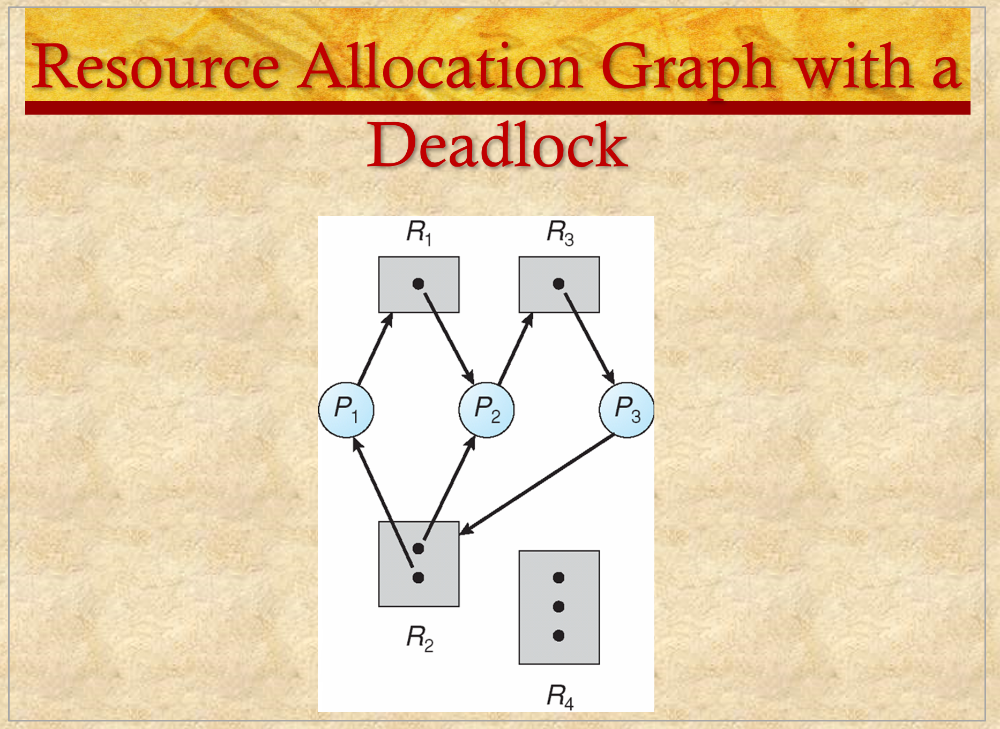

# ENEE447 Lecture 13 

> 3/6/24

### Chapter 10b: Real-Time Scheduling (cont.) 

Last time: Loking at RT scheduling algorithms  

First one: Static scheduling
* Create static table  

Second: Rate Monotonic Scheduling (RMS)
* Create priorites based on priorites  

We're not really inoring deadlines, but we implicitly pay attentino to dealine on stati table-driven scheduling  

  

  

EDF uses the completion deadline information  

This utilization is different from the RMS algorithm that we saw last time which had a utiilization cap of 69% (nice)  

  

Due to the preemption, we preempt T2 when T1 reaches its deadline AND is not yet finished  

In RMS, when we reached a deadline, the task that had reached said deadline would get priority aand start running. This is not the case here  

  

Just giving fixed priority will not give higher utilization since the priorities may cause some tasks to miss their deadlines  

  

  

3 algos for periodic tasks:
* Cyclic
* RMS
* EDF  

STarting deadline means "At wchich time do we have to start"

  

IF nonpreemptive, may not always be the best
* If preemptive, its good enough  

  

For the first timeline, we see that without preemption, the B task's deadline is missed  

  

Frist bullet is an ASSUMPTION  
* Because of this, this method is mostly theoretical  

Utilization could be lower since you are purposely idling  

  

  

Issure not only for RTS  
* Any ststem with priorites  

Sometimes, we have a situation where there are 2 tasks:  

T1---------|LCK|------
T2                    |try_LCK|  
                        ^ Will fail & be blocked
Where T2 priority > T1

T1---------|LCK|------
T2                    |try_LCK|  
T3                    -----------------

Where T3 priority > T2

When a low priority task acquires a lock or resource and does not release it soon enough to allow higher priority tasks to access it  

  

The best-known instance of priority inversion involved the Mars Pathfinder mission. This rover robot landed on Mars on July 4, 1997 and began gathering and transmitting voluminous data back to Earth. But a few days into the mission, the lander software began experiencing total system resets, each resulting in losses of data. After much effort by the Jet Propulsion Laboratory (JPL) team that built the Pathfinder, the problem was traced to priority inversion  

  

T3 has lowest priority, followed by T2 and then T1  

  

IN the Mars rover case, when T3 has the resource as the lowest priority task, it will gain temporary higher priority  

  

t1 : T3 begins executing.
t2 : T3 locks semaphore s and enters its critical section.
t3 : T1, which has a higher priority than T3, preempts T3 and begins executing.
t4 : T1 attempts to enter its critical section but is blocked because the semaphore is locked by T3. T3 is immediately and temporarily assigned the same priority as T1. T3 resumes execution in its critical section.
t5 : T2 is ready to execute but, because T3 now has a higher priority, T2 is unable to preempt T3.
t6 : T3 leaves its critical section and unlocks the semaphore: its priority level is downgraded to its previous default level. T1 preempts T3 , locks the semaphore, and enters its critical section.
t7 : T1 is suspended for some reason unrelated to T2, and T2 begins executing.  

  

  

None of the three big OS (Linux, Unix, Windows) were made with RTS in mind
* Only extended to acomodate RTS later

Using linux most likely means you have soft deadlines anyways  

  

  

General puropse OS usually dont care aobut your deadlines  

  

### Chapter 6: Deadlocks  

Deadlocks: 2 or more processes are holding onto locks/ resources and waiting for locks/ resources that are in turn being held as well  

In this chapter, we want ot adddress deadlocks more
* Identify contidions for deadlock
* Methods to deal with deadlocks and to prevent them
* How to detect deadlocks  

  

  

  

  

Example where it could result in deadlock (depends on speed and other factors)  

  

Mutex: If a resource can be shared, it will not result in deadlock  

If there is only one resource and multiple tasks want it, does NOT guarantee deadlock  

No Rollback (preemption) : Goes back to the beginning of a task without releasing the resources that were held  

Not easy to break these conditions  

  

  

Arrow from rescource to process means that the resource has been allocated to the corresponding process   

The other way around means that process is waiting for resource  

Is this in a deadlock?  
* No
    * Since P3 is not waiting for anything, it can stop and release its resource, thus allowing P2 to run. Once P2 is done, it in turn releases its own resources, allowing P1 to run

Sequence: P3-> P2-> P1

When all resources have one dot, if there is a cycle then we know that there is deadlock for sure  

If we are able to find a sequence then we know there is no deadlock (yet...)  

  

Here, we can clearly see that we have a deadlock since P3 is requesting a resource that is currently being held by other processes, one of which (P2) is waiting for a resource P3 is holding onto  

  

  

^^^ VERY IMPORTANT!!! ^^^  

  

  

Prevetion: The programmer is writing th code in such a way that will prevent deadlocks from occuring  
* Ensure that at least one condition is not held  

For dining philiosphers, we may assign each chopstick with a number. Then, we have the philospohers pick up their chopsticks in increasing order, which will prevent deadlocks  

*Video here?*  

  

  

Circular wait is usually the easiest prevention to implement  

  

  

Programmer is not really doing anything here, since th OS is the one doing so  

  

Review on Monday, my continue if there is time afterwards  