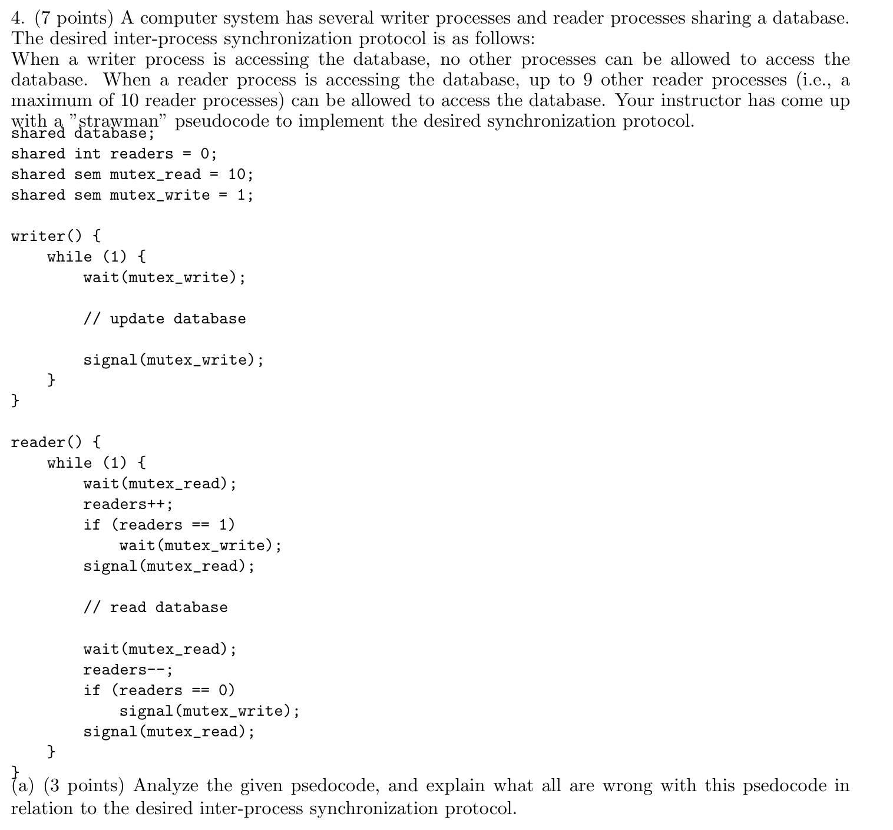
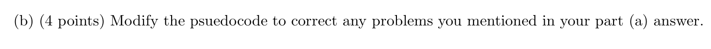
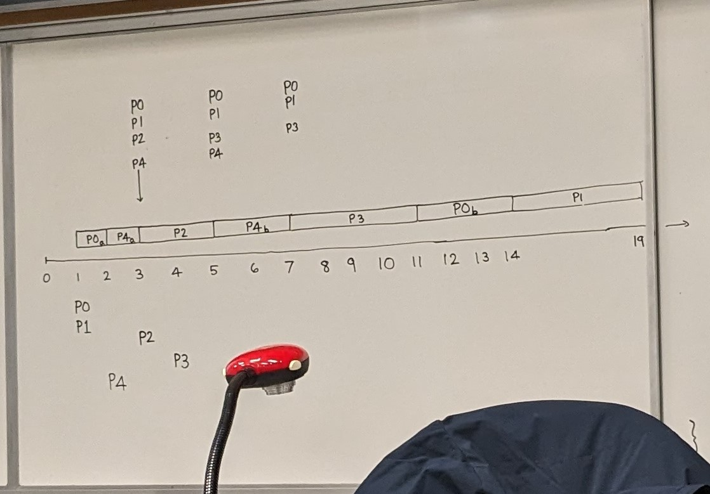
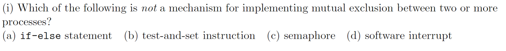
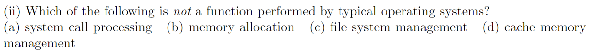
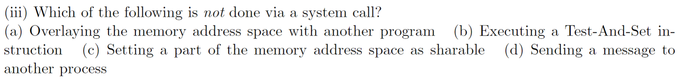
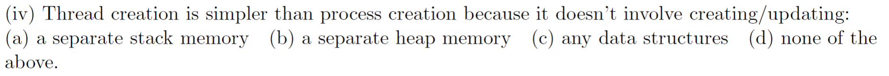
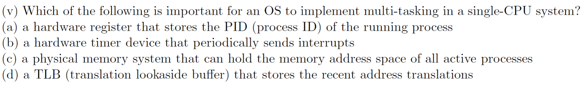
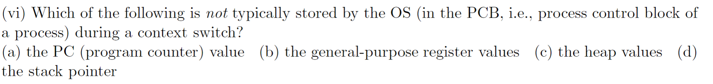
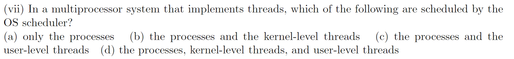

# ENEE447 Lecture 14  

> 3/11/24

### Midterm 1 Review  

Binary sema: mutual exclusion
* Only one thread can have the lock  
* Need to init to 1
* First process/ thread will get it and decrement it to 0
    * Sequential ones will need to wait for the semaphore to be greater than one  
```
m = 1;
```
Up to 1 thread can acquire the lock  

General sema: 
* Init to n

Say we init general sema to 5. 
```
m = 5;
```  

Up to 5 threads can acquire the lock

For reader-writer, need general sema  

Last question on spring 2018 exam:



  

`writer` is fine  

`reader` has a mistake where we initialize the variable `readers` to 0, and update it every time (data race)  

First reader will wait, but after that all the other readers will not wait  

If we try to init `mutex_read` to 1, we can guarantee mutual exclusion, but then we lose the ability to have multiple readers (up to 10)  

Second half is similar to the first (data racing)  

To fix it, we need to fix `reader`  
1. Continue to use the variable `reader`
2. Use `reader` as a semaphore  

```
shared int readers = 0;
shared sem mutex_reader = 1;
shared sem mutex_write = 1;
```  

Need a mechanism to ensure we do not go over 10  

```
shared int readers = 0;
shared sem mutex_reader = 1;
shared sem mutex_writer = 1;

reader()
{
    while(1)
    {
        while(readers == 10);
        wait (mutex_reader);
        readers++;
        if (readers == 1)
            wait (mutex_writer);
        signal(mutex_reader);        
        
        // read database

        wait(mutex_reader);
        readers--;
        if(readers == 0)
            signal(mutex_writer);
        signal(mutex_reader);
    }
}
```

This is wrong, however. We may have a data race when checking the value of `readers`

Using a semaphore instead of keeping the variable makes things easier  

```
shared sem num_readers = 10;
shared sem mutex_reader = 1;
shared sem mutex_writer = 1;

reader()
{
    while(1)
    {
        wait (mutex_reader);
        readers++;
        if (readers == 1)
            wait (mutex_writer);
        signal(mutex_reader);       
        wait (num_readers); 
        
        // read database

        signal (num_readers)
        wait(mutex_reader);
        readers--;
        if(readers == 0)
            signal(mutex_writer);
        signal(mutex_reader);
    }
}
```

```
shared int readers = 0;
shared sem num_readers = 10;
shared sem mutex_reader = 1;
shared sem mutex_writer = 1;

reader()
{
    while(1)
    {
        wait (num_readers);
        wait (mutex_reader);
        readers++;
        if (readers == 1)
            wait (mutex_writer);
        signal(mutex_reader);       
        
        // read database

        signal (num_readers)
        wait(mutex_reader);
        readers--;
        if(readers == 0)
            signal(mutex_writer);
        signal(mutex_reader);
    }
}
```

Now, with the above code, we have a semaphore for the readers that could potentially come into the critical section. `num_readers` will be decremented until we reach zero. We wait on `mutex_reader` in order to have access to `readers`. If this is the first reader, we wait on `mutex_writer` in order to make sure writer does not make any changes to the database while we read. Once we get `mutex_writer`, we let go of `mutex_reader` in order to let any other readers coming in to use it. When another reader comes in, it will wait on `mutex_reader` and increment `readers`. At this point, `readers = 2`. This means that we don't have to wait on `mutex_writer` since the first reader already took care of that for us. Thus, we can continue to signal `mutex_reader` and read from the critical section. Once we are done with the critical seciton, we signal `num_readers` in order to free up a slot for any other potential readers that may be waiting for a turn to read. From here, we wait on `mutex_reader` in order to get access to `readers` in order to decrement it. Once `readers = 0`, we know we are at the last reader, and we may release `mutex_writer`. Finally, we release `mutex_reader` since we are done altering `readers`  

Scheduling:  

Preemptive priority:  

  

Spring 2018 Multiple choice

  

a and d are not really geared for mutual exclusion  

Software interrupt is just a system call. Semaphores create system calls 

if else statements also do not guarantee mutual exclusion

* Professor notes that the explanation is very important, and he would accept either a or d, as long as the explanation is solid  

  

Answer: d
* This is done by the cache manager (HW)  

  

Answer: b

Test-and-Set is purely SW, which allows programmers to circumvent system calls 

c can only be done by the OS  

  

Answer: b 

Every thread has its own stack

Heap is dynamically allocated  

  

All of these are helpful  

Most essential, however, would be a HW timer. If none exists, we rely entirely on system calls
* What if a process is stuck in an infinite loop  

  

Answer: c

Heap values are too big  

  

Answer: b  

Turn around times for the phone pic problem  

P0: 14 - 1 = 13
P1: 19 - 1 = 18
P2: 5 - 3 = 2
P3: 11 - 4 = 7
P4: 7 - 2 = 5

Wait times
P0: 13 - 4 = 9
P1: ...

Left to the reader as an exercise :)))
