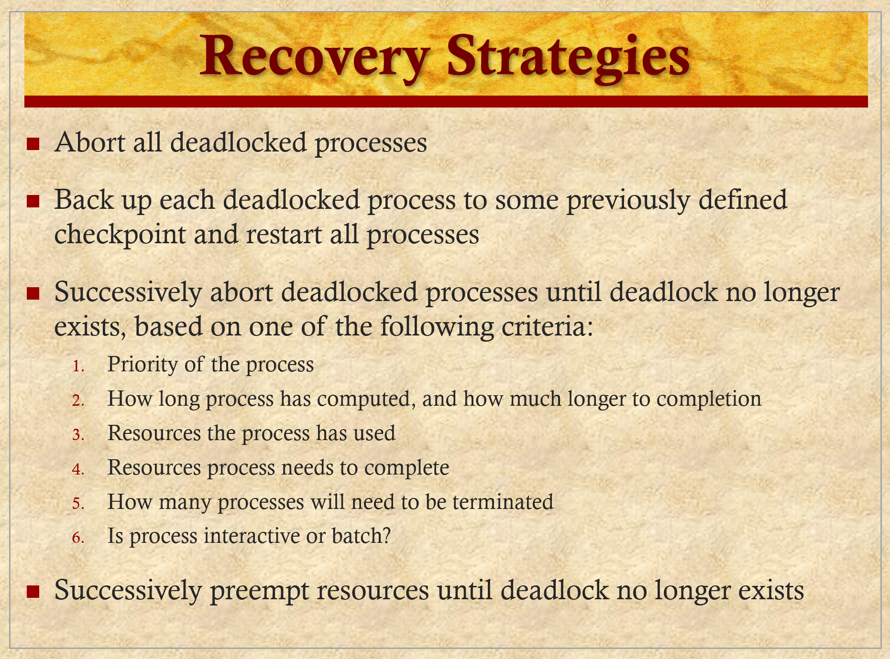

# ENEE447 Lecture 16  

> 3/25/24

*Lecture 15 was midterm*

### Chapter 6: Deadlocks (cont.)  

Exams will be returned on Wednesday  

Before the break: Chapter on Deadlocks  

How to del with deadlocks
* Deadlock prevention algos
* Deadlock avoidance
* Deadlock detection  

Avoidance: We will let resources only after making sure the allocation will not yield an unsafe state  

  

* Hold and wait
* Mutex
* No preemption  

Recall: For dining philosophers, we number the chopsticks and assign them in increasing order  

We start in a safe state, and as we assign more and more resources, we are more careful about assigning resources in order to **avoid** a deadlock  

  

Within the unsafe state, deadlock exists
* This means that unsafe state DOES NOT explicitly mean deadlock  

Think of a finite state machine that transitions around in the safe state, but then transitions into the unsafe state. From here, it **may or may not** return to the safe state again. If it never moves from it's state in unsafe, it is in deadlock    

  

  

Dotted edge means that P1 will at some point request R2, but it has not done so yet  

Is this currently in a safe/ unsafe state? Deadlock?  
* No cycle, therefore we are NOT in deadlock

If we are careful from now on, is there guarantee that all processes can finish?  
* If not, then we are in an unsafe state

Both P1 and P2 request R2. If we focus on P1 only and service it, we know that if we give it R2, it will complete since R2 is the only other resource it is requesting. ONce it has R2, it can complete and terminate, leaving both resources available to P2, which in turn uses the resources it requested and terminates  

  

Is this a guaranteed deadlock?  
* No
    * Dotted edge only means at some point in the future, P1 will need R2. We don't know if P1 will release R1 in order to allow P2 to use he resource  

  

  

Is this in a safe state or not?  

  

Whenever there is a request like this, we need to see if it is possible to grant.  

Just comparing the request to the available resources is not enough to determine safety. We need to run the Banker's algorithm in order to ensure safety  

(3,3,0) cannot be granted: (2,3,0) < (3,3,0)  
* Running algorithm not necessary  

(0,2,0) can be granted: (2,3,0) > (0,2,0)  
* Need to run algorithm to ensure safety

  

Every time a request is made, we need to recalculate  

  

  

once in a while, the OS will do a check. If a resource has only one instance, it can look for cycles to determine deadlock. If there are multiple instances, need to perform algorithm similar to Banker's algorithm  

  

  

  

  

IN order to find deadlock here, we need to find a sequence. If we find a satisfactory one, we know we do not have deadlock  

  

  

In order to break out of deadlock, it will need to terminate one of the processes involved in the deadlock and release the resources  

  

  

  

*We skipped over the dining philosophers slides since we have been using the example frequently across chapters*

  

