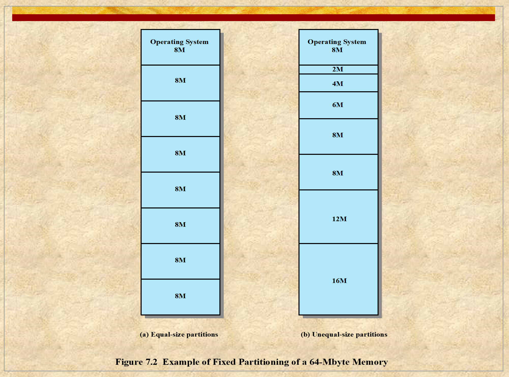

# ENEE447 Lecture 17  

> 3/27/24

### Chapter 7: Memory Management  

So far: Process and processor management  

Other component: Memory management  
* OS has important role  

Most programs cannot have enough memory  

How much does each process get?  
* This is the responsibility of the OS, and is what we mean by Memory Management  

What the programmer sees:  
```
-----0x0000  
|   |  
|   |  
|   |  
|   |  
-----0xffff
```
.text  
.data  
heap  V


stack ^

Hardware will take care of the memory, which in turn is taken care of by the OS  

Medium term scheduling: Say we have 100 active processes, but we do not have enough memory. OS will swap out processes in order to ensure each process will have enough memory to do its thing  

Chapter 8 will continue this idea with one specific memory management method: Paging :cold_sweat:  

  

Compiler places text, assigns addresses to every time. However, it will be relocated when it actually goes into memory
* Done with combination of HW and OS  

We don't want P1 to access P2 stuff, therefore we must ensure protection  

If P1 and P2 want to share memory, we can have some overlap  
* With contiguous memory, only process memory spaces that are right next to each other may share memory.  

Partitioning: How are you dividing the available memory between processes  

  

  

After some time, say P1 is referring to memory that is not big enough. 
* Swap P1 and wait until we have more space
* Swap out memory that is right next to it (contiguous allocation only)  

  

  

Why?
* No real hard disk, just some flash memory  
    * Has a limited number of write cycles (may be able to only write 100k or 1M times)
* With HDD or SSD, theoretically can write infinite number of times  
* Swapping would then consume the limited number of writes available on the platform  

Anytime memory becomes low (available memory), will start terminating processes from lowest to highest memory  

  

One advantage of contiguous allocation is that we merely need to add the size of the previous processes in order to relocate processes accordingly  

Intel divides the ".text .data" etc. portions into sections:
* CS, DS, SS, etc.  

  

If you say
```
beq $1, $0, 0x4028
``` 
where the address is absolute, when there is relocation, the new address will not line up ???  

  

  

  

  

  

Fragmentation: Due to the way we are allocating, some memory cannot be used  
* External: After some time, two processes terminate and leave memory. Will leave gaps equal to their size, say two 512 MB gaps. If another program comes in and needs 1024MB, we have sufficient space, but not contiguously. Therefore, we cannot use it. 
* Internal: Say the minimum allocation size is 512MB, but a process comes in that only needs 300 MB. We will have space wasted due to the policy of allocating at least the minimum  

[Video on fragmentation](https://www.youtube.com/watch?v=ALahNOwrTvg&ab_channel=Education4u)

  

  

  

Limit register is for protection  

  

  


  

No internal fragmentation, but now we have external fragmentation  

  

  

Say we have three gaps in the memory of sizes 200MB, 250MB, and 300MB. These gaps are in descending order. We have a process coming in with 150 MB needed
* Best: 200MB
* First: 200MB
* Next: Keep a pointer, and search from there. Use the pointer to make sure allocation is done correctly  

[Video on placement algorithms](https://www.youtube.com/watch?v=HBQZ5rlaN-s&ab_channel=ShrutiP)  