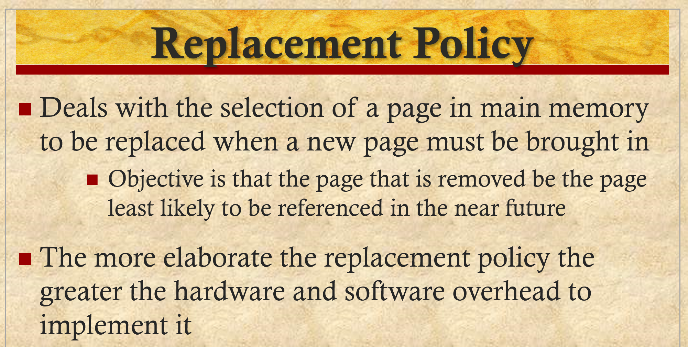

# ENEE447 Lecture 18  

> 4/3/24

### Chapter 7: Memory Management (cont.)  

  

Adding more frames can cause more page faults  

This is known as Bealdy's Anomaly (FIFO ONly)  

Th point of the graphs is that you don't only want to give the process just one page, you want to find the sweet spot where the number of frames yields the appropriate number of pge faults  

Once you decide how many frames to give to a process, you need to figure out how to replace them when necessary  

  

  

  

The time it takes to do a replacement is twice the time to read ???  

  

Apart from virtual memory, when there i a system call (i.e read), we may get a fault. We need to make sure we do not replace the frame of the device that made the syscall. THis is why we need frame locking  

 

  

Optimal is the best, but unrealistic  
* It depends on us knowing the future  

Say with the optimal, knowing the future, we will have 4 page faults
* If FIFO is giving 10 page faults, we know it (FIFO) is not great
* Now say that LRU gives 5 faults. Now we know LRU to be our best bet since we cannot do significantly better than 4 anyways  

  

  

  

Say there are 16 frames in our system.  
HOw do we keep track of the order?  
* If we add another field and use something like a time stamp for each frame  

When the processor sends a request, it also sends a time stamp  
* Counter init'd to 0. Every clock cycle you increment the counter (requires timer/ clock). Every time an access is made, the current time on the timer will be the time stamp
    * THis will allow us to see which was accessed the earliest  

Counter will eventually ovr flow, so we will need to figure out how to handle that  

Comparing FIFO to LRU (Hardware Overhead):  
* FIFO: COunter, timestamp field
* LRU: ", " " "  
* LRU approx / Use bit: 1 bit / frame
* LRU approx / Clock algo: 1 bit / frame


Comparing FIFO to LRU (Time overhead, no page fault):  
* FIFO: N/A
* LRU:  Update timestamp
* LRU approx / Use bit: Set use bit to 1
* LRU approx / Clock algo: Set use bit to 1

Comparing FIFO to LRU (Time overhead, page fault):  
* FIFO: Update timestamp
* LRU: Update timestamp  
* LRU approx / Use bit: ???  

FIFO is a lot easier since we do not need to update at every clock cycle.  

LRU is a lot better  

  

  

Change the "timestamp" field into a "Use" bit  

  

  

Keeps a pointer that is at the very top. It tries to replace the use bit but it is already occupied. It changes the bit to 0 and moves on until it sees a one. It will eventually come back around and see the 0 and fault  

[Video on 2nd chance algo](https://www.youtube.com/watch?v=voiL2-nQmlU&ab_channel=BBarters)  

  

  

  

EDIT THIS VVV

```
The optimal policy selects for replacement that page for which the time to the next reference is the longest.
It can be shown that this policy results in the fewest number of page faults [BELA66].
Clearly, this policy is impossible to implement, because it would require the OS to have perfect knowledge of future events.
However, it does serve as a standard against which to judge real-world algorithms.

Figure 8.14 gives an example of the optimal policy. The example assumes a
fixed frame allocation (fixed resident set size) for this process of three frames.
The execution of the process requires reference to five distinct pages.
The page address stream formed by executing the program is
2 3 2 1 5 2 4 5 3 2 5 2
which means that the first page referenced is 2, the second page referenced is 3, and so on.
The optimal policy produces three page faults after the frame allocation has been filled.
```

  

  

MOst OS will bring in additional pages and keep it in kernel memory.  

```
Although LRU and clock policies are superior to FIFO,
they both involve complexity and overhead not suffered with FIFO.
In addition, there is the related issue that the cost of replacing a page that has been modified is
greater than for one that has not, because the former must be written back out to secondary memory.

An interesting strategy that can improve paging performance and allow the use of a simpler page replacement policy is page buffering.
The VAX VMS approach is representative. The page replacement algorithm is simple FIFO.
To improve performance, a replaced page is not lost but rather is assigned to one of two lists:
the free page list if the page has not been modified, or the modified page list if it has.
Note that the page is not physically moved about in physical memory;
instead, the entry in the page table for this page is removed and placed in either the free or modified page list.

The free page list is a list of page frames available for reading in pages.
VMS tries to keep some small number of frames free at all times.
When a page is to be read in, the page frame at the head of the list is used, destroying the page that was there.
When an unmodified page is to be replaced, it remains in memory and its page frame is added to the tail of the free page list.
Similarly, when a modified page is to be written out and replaced, its page frame is added to the tail of the modified page list.

The important aspect of these maneuvers is that the page to be replaced remains in memory.
Thus if the process references that page, it is returned to the resident set of that process at little cost.
In effect, the free and modified page lists act as a cache of pages.
The modified page list serves another useful function: Modified pages are written out in clusters rather than one at a time.
This significantly reduces the number of I/O operations and therefore the amount of disk access time.

A simpler version of page buffering is implemented in the Mach OS [RASH88].
In this case, no distinction is made between modified and unmodified pages.

```

  

With large caches, page replacement can have a negative effect  

  

  

Some similarities with replacement, but there are key differences ^  

Say we have 1k frames and 10 processes (including OS).  

We can divide equally that way everyone gets the same 

However, giving varying numbers of frames to processes may be more optimal  

  

  

Local means, if we have a fault, we only address it with one of the frames that was given to the process  

  

