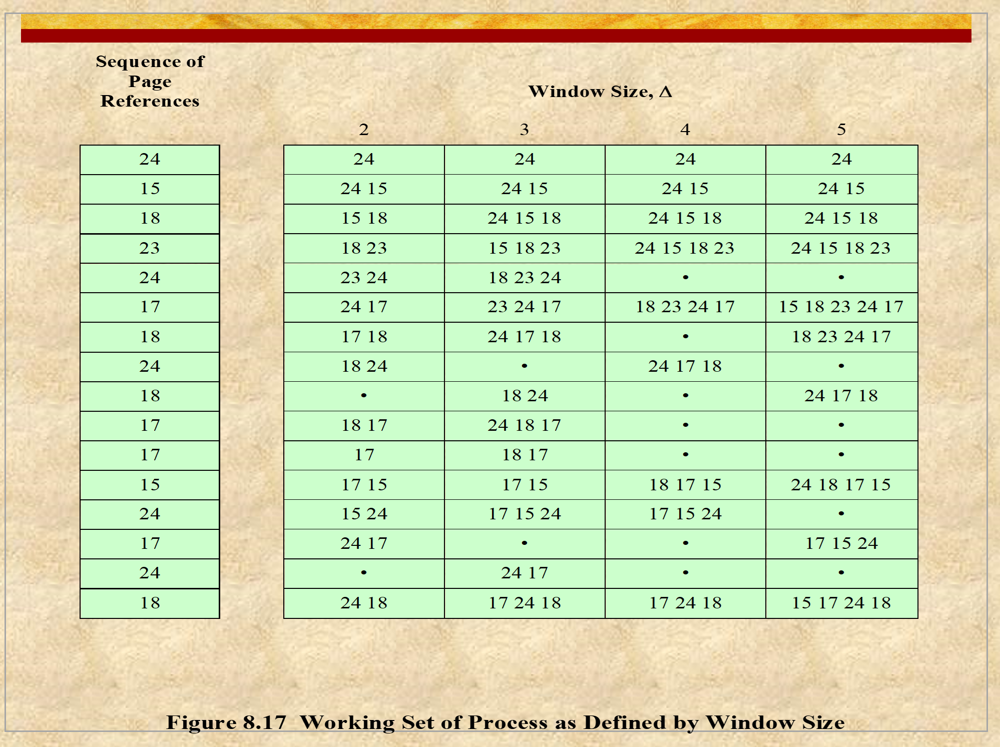

# ENEE447 Lecture 20  

> 4/8/24

### Chapter 8: Virtual Memory  

Last time: Replacement policies  

  

Fixed allocation: every process needs their own frames  

Variable: Things can change, can have local replacement  

Say we have P1,P2,...Pn

P1=4 frames
P2=5

After some time, P1 needs 6, and P2 still 5. 

In between this time, we have a page fault. We look at the 4 or 5 frames (depending on which process we're looking at) at decide which frame would be best for the replacement  

The main decision here is figuring out how many frames to give to eah process

If equal allocation, its easy
* Becomes difficult if not  

  

  

Every process needs to tell upfront how much memory it needs (similar to bankers algorithm for deadlock)  

**NOTE**: the 62 is because we need some frames free (not optimal to completely exhaust resources)  

The decision of how many to leave free is up to the OS  

  

  

  

If you are doing global replacement, it happens automatically. This is not the case with local replacement however  

Say P1 encounters many page faults. OS takes notice and will increase frames given to that process.  

  

Delta: How many unique pages were accessed by the process in a set amount of time  

Working set depends on the size of the window  

See approximately how many frames we should give to a process to let it run comfortably without compromising the other process's ability to run  

Goal: Figure out the comfortable working set size  

  

Working set depends on when you're looking on the screen and how big your delta is  

To find the deltas, you look behind however many references by the window size and include all the unique references  

Crucially:  2 issues
1. What should be the window size? 
2. How do you track which pages were referenced?  

Operating system cannot just look backwards unless it stores all that information  

OS is not active  

We need HW support in order to track what references are made by whom  

LRU approximation was done with the "use" bit  

  

Thrashing: Oops, all page faults!
* OS spends more time switching than actually executing processes  

Since we have thrashing, we know we have too many processes loaded in. Therefore, we need ot load them out to make more room for other processes to run comfortably  

  

In a page table that we have, we have one bit that we use as the "use" bit.  

At the beginning, all use bits are 0. As they are referenced, we increment them  

We continue this for the window size. at the end, we go back and count the 1's that we have made. This will give us the working set  

Once we have recorded this, we set them all back to 0  

Then, we repeat for the next Delta pages  

Our windows are non-overlapping  
* Won't be able to capture any patterns that may occur in two separate windows  

Solution: Use 2 bits for the overlap  

  

Here we can see how dynamic working sets can be  

  

Does not require HW support  

  

  

  

*Next few slides are on vendor-specific approaches, no need for notes*  

### Chapter : IO Management  

