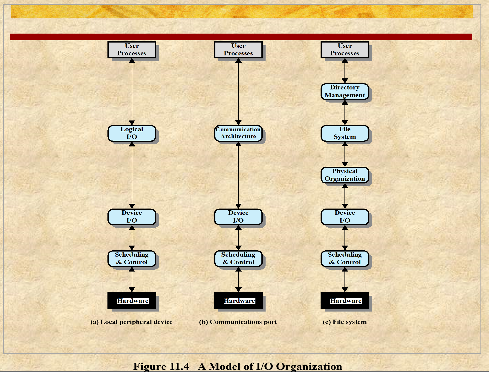
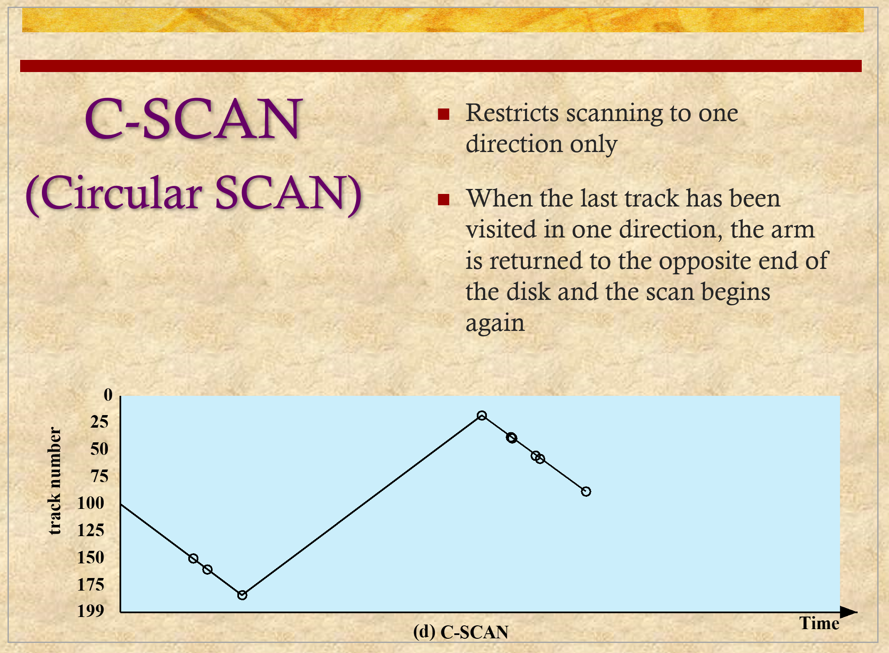
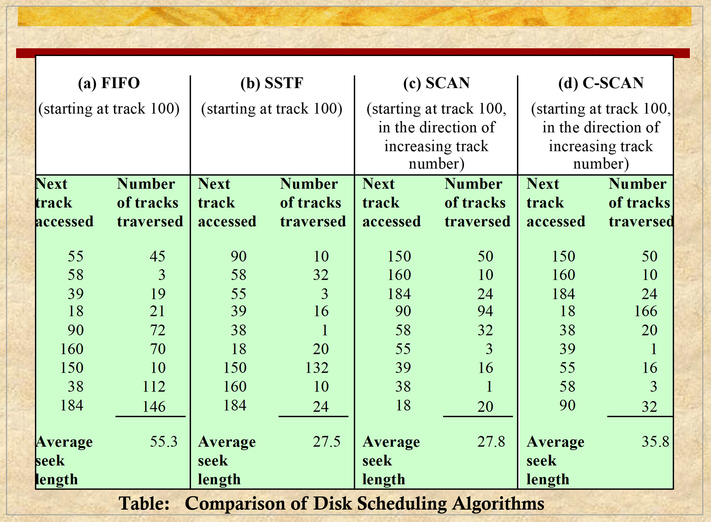

# ENEE447 Lecture 20  

> 4/10/24

*Exam 2 will be on 5/8*

### Chapter 10: IO Management  

Say there is a hard disk, and there is a disk controller. The Disk controller may not know too much about the application.  

Say we have 4 processes making requests. Device controller does not know what these processes are doing.  

We let some of the management be done by the OS for this reason  

Some buffering done by device controllers, some by device drivers  

  

  

When it comes to managing the processor and the memory, there is not much variety  

IO, on the other hand, as we can see, has much more variety  

  

Other techniques
* Strobing  
* [the ones in the slide]
* IO channels

As we move down the list here ^, the device controller complexity goes up  
* Not so with the device driver!  

Creating IO devices as memory  

Programmed IO
* Read status
* check "
* If not ready return to read status
    * This yields a busy wait  

Int. 

Device sends HW interrupt to system and driver takes care of it ???  

IO channels: Device controller is not just copying;/ transfer but is also doing some processing  

Most of the work done by these techniques ^ is done by the device drivers  

  

  

  

If you look at a processor, (Intel, AMD)  and memory, 

When it comes to IO devices, there are mny more companies that make IO devices (mice, keyboard, etc.)  

Generality goes up. If something is more general, it is typically less efficient. Therein the tradeoff between efficiency and generality  

More standards with IO, less with memory and even less so with CPUs  

  

Shows 3 types of interactions with IO and user processes  

User process will do a system call, bringing it to the OS  

  

Types of devices
* Character oriented: Keyboards
* Stream: Audio, video
* Block: Storage

  

  

  

  

  

  

Hard disks are slowly becoming obsolete due to the prevalence of SSDs  

OS has a role to play  

  

We may have to wait for a device to be ready  

Only the data transfer section is doing real work, the rest of it is just waiting  

  

  

10 ms comparatively is very long  

  

  

  

  

  

  

  

*Video on scheduling algorithms?*  

  

LOOK: You don't go all the way to the end with SCAN, you go to the furthest track you need to go to, then turn around
* Con: If a new request comes in after the "turn", it will need to wait a very long time to get serviced  

  

  

  

*Will finish this chapter on Monday*  