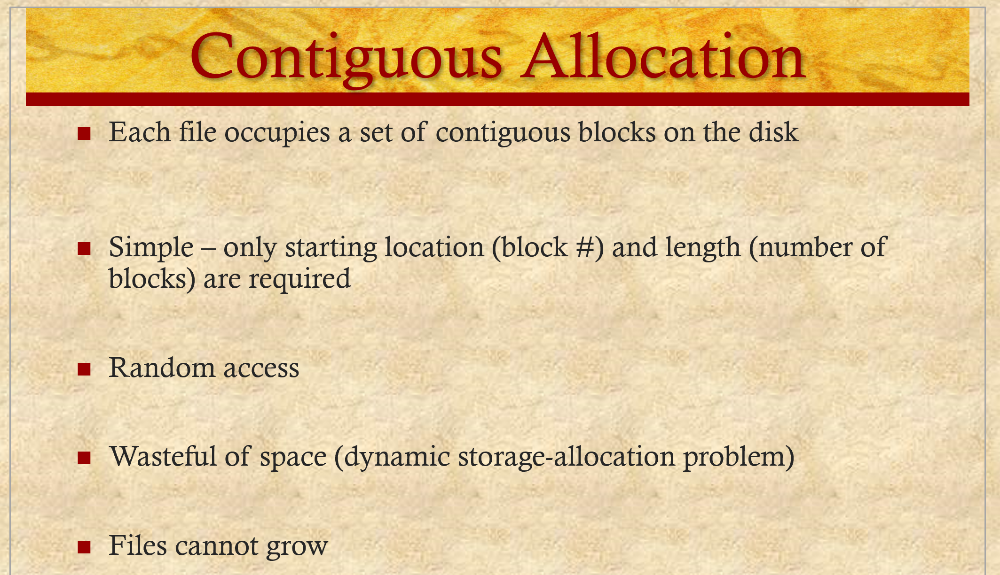
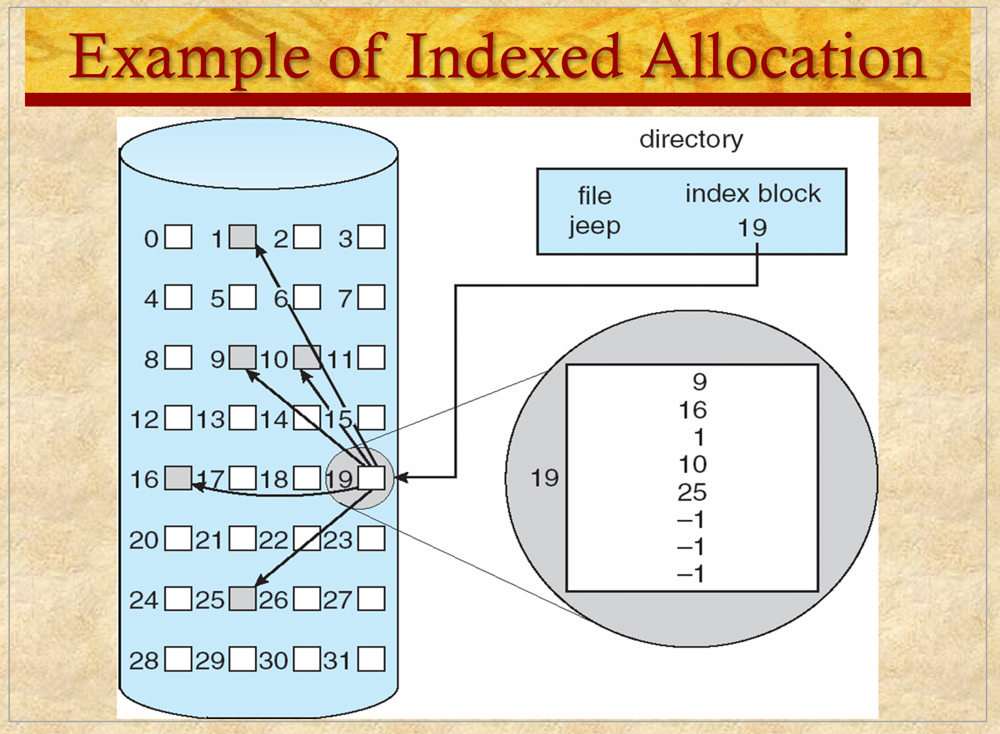

  

To Organize data better, tree stuctured directiries are better suited  

  

  

  

  

Unix allows acyclic directories via linking, giving more paths to the same place  

Need to make sure  

If we wish to delete `/spell/count`, it deletes the links between the directories. It does NOT truly delete the file  

Here, with acyclic, if we wish to `edit /dict/count`, what should happen?  

Linux privides the command `unlink`, which will remove the path but NOT delete the file. Therefore, when we try to access count via edit, we can still access count  

This requires additional bookeeping  

  

Cyclic directories may result in infinite loops, which is not ideal  

  

  

  

> A unmounted file system is mounted at a mount point  

* And in other news, cow milk comes from cows!  

  

  

  

  

  

  

  

  

  

  

  

The "d" at the beginning of the permissions slot is for "directories"  

  

  

  

  

open(file, r/w/etc.), what happens is since this is sitting in disk, eveyrtime it needs to know something about it it costs time. What we do is copy relevant info form storage and make a copy in kenrel memory  

  

  

Using the smae API means is you have a single API to interact with the file system, does not matter what arrangement you use, you can use the same commands on files ???  

  

  

How shuld the OS manitain a dirctory?  
* Directory is a part of a tree and a directory keeps track of the files underneath that file  

Dir has a place in a tre structur and keeps a list of files and subdirectories  
* Subject to change  

Operations  
* Search
* List
* Create nodes
* Delete nodes

What data structure is good for this?
* Array?
    * No, arrays are usually fixed, and would therefore be inconvenient to use  
* Linked list?
    * Not really either. Easier to change. Time consuming to search
* Hash table?
    * Yes  

  

Once you get to a leaf node, how to store the file in the disk?  

Contiguous: Same as the name, the entire file is stored back to back on the disk

Linked: File is scattered across the disk with links between the pieces  
* May also be linked by having a separate structure that contains all the links between the pieces  

Indexed: You have a table on disk with direct pointers to the file pieces, which are again scattered across the disk  

  

  

  

  

  

  

  

  

Windows used to (???) use this, now they use NTFS

  

  

Index table is like an array, and you need to decide uprfotn how many blocks it may need.  

With the linked file, you can keep extending it without the same problem  

  

  

  

  

  

  

