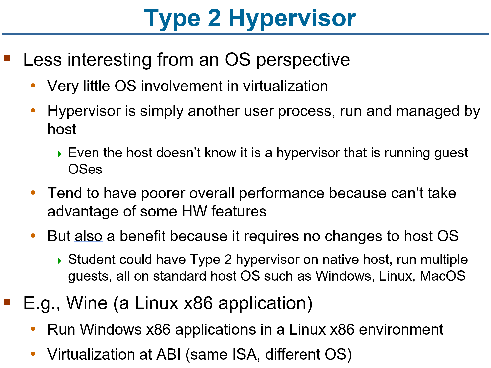
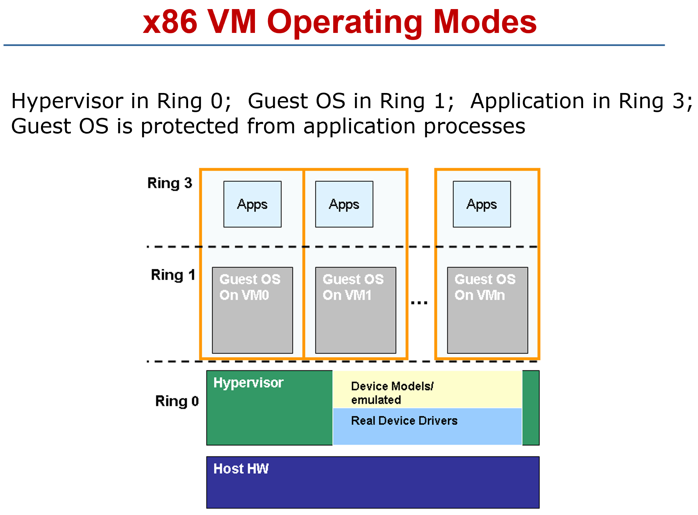

# ENEE447 Lecture 24  

> 4/24/24

### Chapter 18: Virtual machines (cont.)  

Last time: Virtual machines which goes beyond virtual memory  

Talked about different interfaces at which we can do virtualization  

Where are we placing the vmm?

  

REMEMBER: Hardware is directly under VMM in the diagram  

Windows is not written to be as either a host or a guest, thus when virtualizing, we must take these things into account  

Some newer hardware allows more than one mode so you can run the guest OS at a higher privilege  

  

VMWare server in this  case is the VMM  

This is type 2 since we have the VMM on top of the host OS  

  

  

  

  

  

Needs to manage the entire lifecycle of a machine. When a VM is created, there is a config file that keeps this info. When it is terminated, the VMM needs to handle this   

The HOst does its own scheduling and will occasionally call the VMM. VMM will then decide which guest OS to run at that time  

If we have user level threads, the user thread library will decide which thread to do next  

  

When running a program on HW, the outputs should be identical to when said program is run on a VM  

As much of the instructions running in the guest OS should try to execute on the hardware. This means we don't want emulation of *all* instructions.  

Nothing we can do about system calls, but at least the ordinary instructions   

  

AKA: Where do we have the hypervisor?  

Type 0: Runs as firmware inside hardware
* Wont be looking at this as much  

NOTE: BUllet point "Hypervisor implemented as firmware..." should be associated with type 0 hypervisors  

  

  

  

  

  

Main task: We have a guest and a host. The guest has a view of so many things. In the ISA, we define GIIO*s, Sys regs, memory, etc.  

Then, the instructions. The ISA will have defined some arithmetic instructions as well.  

The host ISA, what is actually there, some number of GPIO registers. IN order to implement this, some mechanism must be done to get from the guest to the host  

  

Say we have a set amount of ram. What the VMM does is for the VM, it allocates the black boxes for guest 1, and the lemon (???) boxes for another  

   

Classic VM: Type 1  

3rd bullet: If we do this, Windows will have full access to HW and may interfere with Linux OS. IOW, will not allow VMM to do its job  

  

  

  

When x86 was introduced, there were 4 modes (rings)  

Ring 1 is used for guest operating systems  

  

There will be conceptual questions on the exam about virtualization  

Big questions
* One of the algorithms (bankers, deadlock detection algorithms, etc.)  
* Chapter 10b: Real time scheduling  
* Disk scheduling  

We saw how for each VM, you can have 2 modes that are managed by the VMM. VMM will call the system states for all VMs in memory  

  

