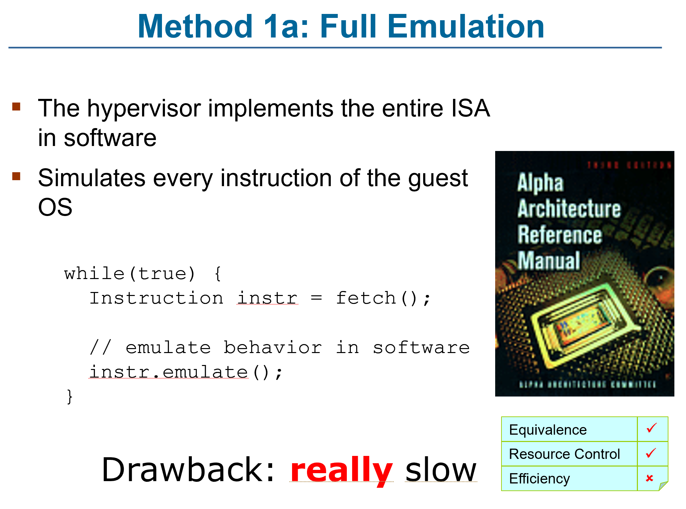
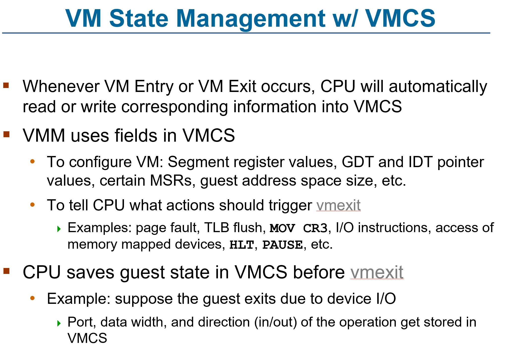

# ENEE447 Lecture 26 

> 4/29/24

### Chapter 18: Virtual machines (cont.)  (cont.)  

3 options for implementing VMs:
1. ISA  
2. ABI  
3. API  

MOstly looking at type 1 implmentaiton
* How do we make it happen?  

  

HW modification hlps with all the rest of them  

  

Not practical since it is inefficient  

Difference between 1a b, in fulll, every abstraction gets emulated (could be using simulator). Trap and emulation most of the absrtascitons are done on the underkying HW

Binary code: Only the executable code is miodified. Not something that needs to be done earlier. Could be doing something else  

Source code modification is not considered pure emulation: Cnanot taek something like Linux and consider it as it comes to you  

  

Simple scalar simulators in 446, same thing being done here. Will take each instruciton and emulate it's function  

Adv. Can have a different ISA  

  

Only cetian insturciotns are emulated. The rest are run on hardware  

HArdware runs on Physical Kernel mode OR Physical User Mode  

The application program may do a systme call. In that case, where will it go?  
* Syscall is decoded, and tries to run on HW. But, once we have identified it, we switch modes to physical KM, and try on the other layers. However, the only layer that is also in physical KM is the Hypervisor.  

  

  

  

  

When x86 wa sintorducd, there were already 4 physical modes. Only 0 and 3 were being used. Later on, they implmented more layers  

  

  

Sensitive == Privilieged  

  

Advanage: Not every priviliaged instruciton will be translated. Some other prviliaged ones can be replaced with non privilged, and therefore run on HW, making it faster  

  

  

  

  

  

  

  

  

  

  

  

  

  

  

  

  

  

  

  

  

  

  

  

  

  

  

*We skipped over A LOT of slides*  

  

  

Analogy: Shipping containers. THese days, lots od shipping is done via these transport ships. We will have a standardized container. The idea is, if we are transporting something hazardous, we may have ot ship them separately. But, sometimes you can ship everything in the same one, store them side by side, on top of each other, etc.  

Try not to run something NOT on a physical machine, but on a virtual container  

Can stop running in one place, and continue running in another  

