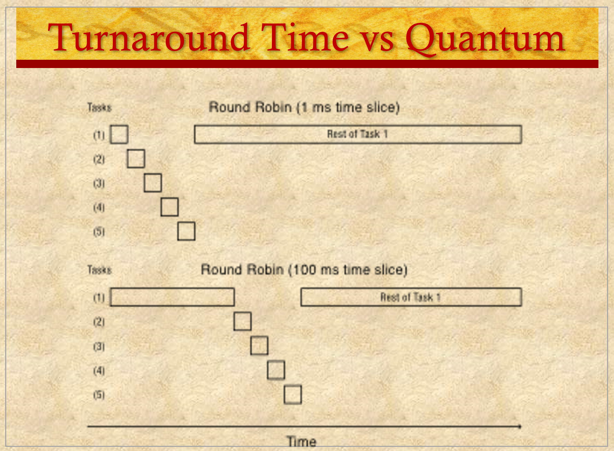
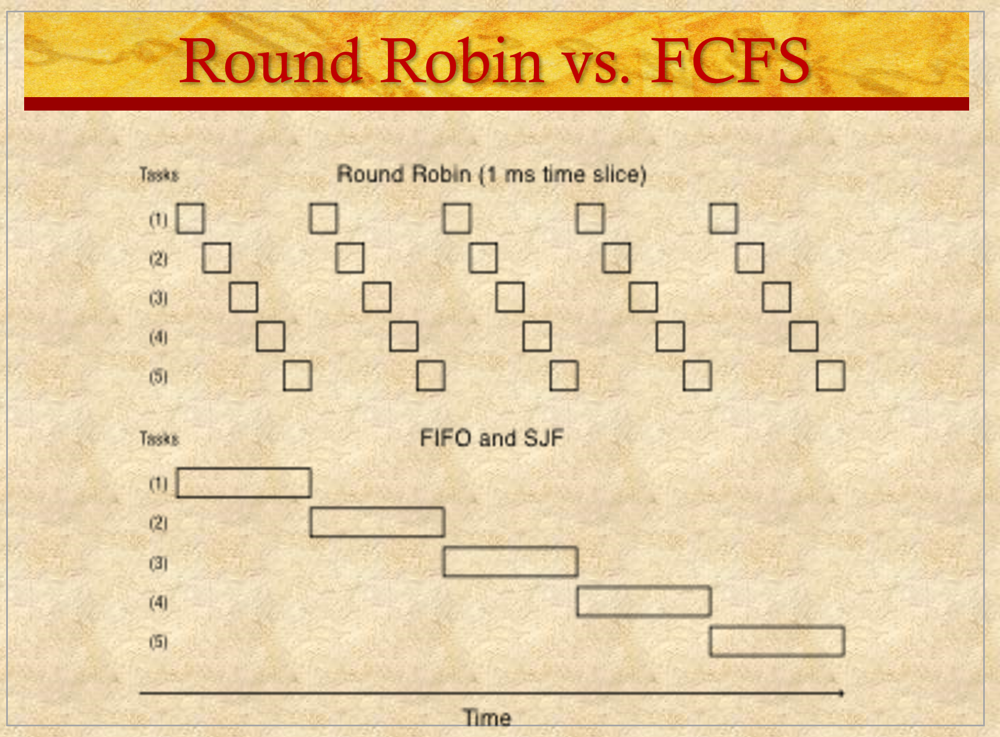
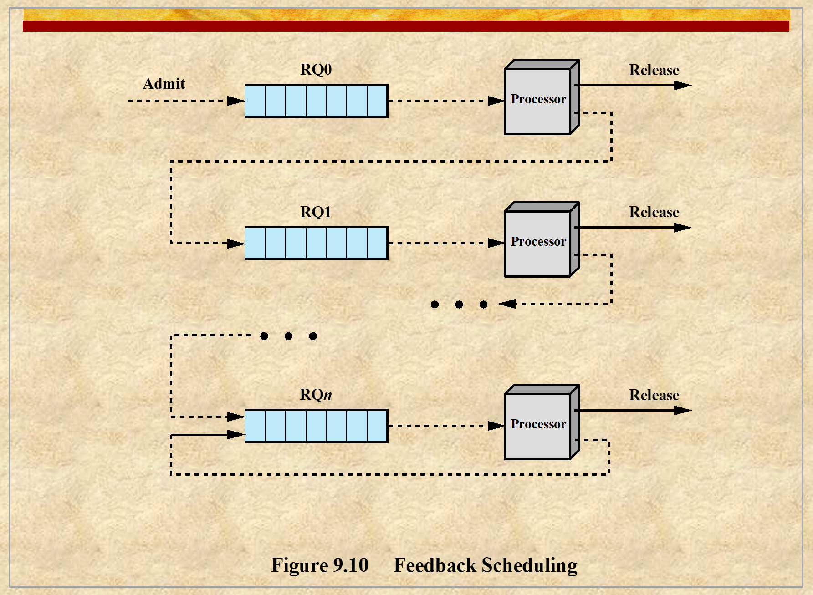
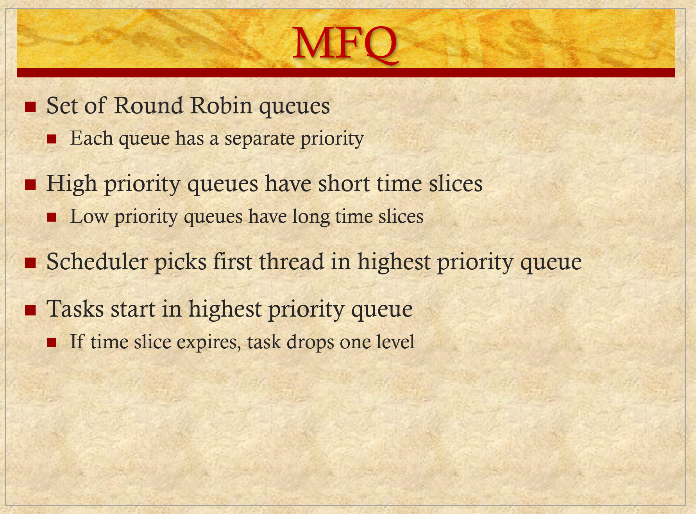

# ENEE447 Lecture 26 

> 4/29/24

### Chapter 15: Security  

Chapters not covered in the first exam will be covered in the midterm a week from today  

Big questions: 
* Deadlock chapter
* Chapter 10b (RTS), 
    * Deadlines
* Memory management (first chapter, chapter 7),  
    * Fixed partition, buddy, paging
* Chapter 8 (Virtual memory) 
    * Different algorithms: Page replacement
        * FIFO, LRU, Clock algorithms, Working set algo  
* Multicore processors (Chapter 10a)  

Traditionally, OSs have not had a big role in security. However, that is changing as times do as well  

Make OS secure, and how can the OS help in making the system secure?  

  

If ou isolate and not connect your system, it is the safest. But then its not very useful for much, is it?  

> The safest ship is the one that never sets sail

No matter what, no system can ever be 100% secure  

If you try to make a system more secure, performance will be impacted  

Ultimately, there must be a trade off  

The more sharing is allowed, the more vulnerable you become  

  

I personally disagree with the last bullet. If you don't know how you got in, how can the defender know? Security specialists prepare for attacks by thinking of what an attacker may do  

  

  

Last bullet is a Linux command. The reason its a problem is because there is a space between the wildcard and the .o, meaning it will remove ALL files, not just the .o files  

  

  

Many companies try to make chips in other countries. WHen they place an order and tell the company to make a billion chips. Once they have the intelligence, they can copy it and sell it on the black market  

SYstem differentiates UM and KM by a single bit. HW attacks happen by adding a module that, after some time, can flip this crucial bit  

  

  

  

  

  

  

  

  

  

  

  

  

Fun fact: The portion with NO_OP is known as a NO_OP sled. Since there are multiple NO_OPs, the SP will continue to "slide" down until it hits the payload, in this case the modified shell code  

  

  

  

  

  

  

  

  

  

  

  

  

  

  

  

  

